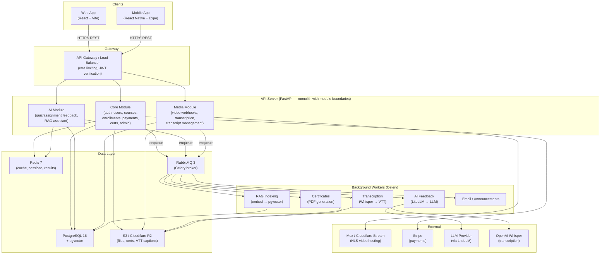

# XOXO Education

XOXO Education is a proprietary, AI-native Learning Management System (LMS) built API-first to serve a React web app and a React Native mobile app from a single backend. It is built from scratch — not forked from Frappe or any other LMS — in order to own the full tech stack, build AI as a first-class feature, and design a mobile-ready API from day one.

Students enroll in courses, watch video lessons with AI-generated captions, take quizzes and assignments with AI feedback, and earn verifiable certificates. Admins create and manage courses, grade submissions, run analytics, and configure AI behavior per course.

---

## Table of Contents

1. [System Architecture](#1-system-architecture)
2. [Tech Stack](#2-tech-stack)
3. [Project Structure](#3-project-structure)
4. [Local Development](#4-local-development)
5. [Roles & Access](#5-roles--access)
6. [Sprint Roadmap](#6-sprint-roadmap)
7. [Contributing](#7-contributing)
8. [Security](#8-security)

---

## 1. System Architecture



**Architectural principles:**

- **API-first, stateless servers** — All state lives in PostgreSQL or Redis. API servers scale horizontally behind a load balancer.
- **Monolith with module boundaries** — Core, AI, and Media are modules within one deployable service. Split into microservices only when traffic demands it.
- **Event-driven background work** — Transcription, AI feedback, RAG indexing, email, and certificate generation are Celery tasks and never block the HTTP request cycle.
- **Graceful AI degradation** — If the LLM is unavailable, submissions are accepted and queued; the product never blocks on AI availability.
- **AI as a first-class feature** — Not a plugin. Feedback, transcription, and RAG are built into the data model and task pipeline from Sprint 1.

---

## 2. Tech Stack

### Backend

| Layer | Technology | Notes |
|---|---|---|
| Language | Python 3.12 | Async-native, best AI/ML ecosystem |
| Web framework | FastAPI (async) | Auto-generated OpenAPI, dependency injection |
| ORM | SQLAlchemy 2 (async) | Type-safe, pgvector support |
| Migrations | Alembic | Forward-only schema versioning |
| Task queue | Celery 5 | Async jobs: transcription, AI, email, certs |
| Message broker | RabbitMQ 3 | Celery task broker (AMQP) |
| Cache / results | Redis 7 | Celery result backend, session store, rate limiting |
| Validation | Pydantic 2 | Request/response schemas |
| Auth | JWT RS256 + OAuth2 | 15 min access token, 30 day refresh cookie, Google login |
| AI abstraction | LiteLLM | Unified interface to multiple LLM providers |
| Transcription | OpenAI Whisper | Auto-captions from video audio |
| Vector search | pgvector (HNSW) | RAG lesson indexing in PostgreSQL |
| Video | Mux / Cloudflare Stream | HLS, adaptive bitrate, webhook delivery |
| Storage | S3 / Cloudflare R2 | File uploads, PDFs, VTT captions |
| Payments | Stripe | Checkout, webhooks, refunds |
| Package manager | uv | Fast, deterministic Python packages |

### Frontend (Web)

| Layer | Technology | Notes |
|---|---|---|
| Framework | React 19 + Vite 6 | SPA, fast HMR |
| Routing | React Router v7 | Client-side, nested routes, protected routes |
| Language | TypeScript 5.8 (strict) | Full type safety |
| Styling | Tailwind CSS v4 | Utility-first |
| Components | shadcn/ui | Accessible, unstyled base components |
| Server state | TanStack Query (React Query) | Caching, revalidation |
| UI state | Zustand 5 | Lightweight global stores |
| Video | Video.js 8 | HLS playback, custom controls |
| API client | openapi-fetch | Type-safe, generated from backend OpenAPI schema |
| Package manager | pnpm | Fast, deterministic Node packages |

---

## 3. Project Structure

```
xoxoedu/
├── backend/          # FastAPI API server + Celery workers
│   ├── app/
│   │   ├── core/     # Auth, RBAC, middleware, storage, Redis
│   │   ├── db/       # SQLAlchemy models + session factory
│   │   ├── modules/  # Feature modules (auth, courses, quizzes, AI, admin…)
│   │   └── worker/   # Celery app + background task definitions
│   ├── alembic/      # Database migrations
│   ├── tests/        # Unit + integration tests
│   └── docker-compose.yml
├── web/              # React + Vite web application
│   └── src/
│       ├── pages/    # Route-level page components
│       ├── components/  # Shared UI components
│       ├── store/    # Zustand stores
│       ├── hooks/    # Custom React hooks
│       └── lib/      # API client, auth utilities
└── README.md         # This file
```

See [`backend/README.md`](backend/README.md) for full backend documentation.
See [`web/README.md`](web/README.md) for full frontend documentation.

---

## 4. Local Development

### Prerequisites

- Docker + Docker Compose
- Python 3.12+ with [uv](https://github.com/astral-sh/uv)
- Node 19+ with [pnpm](https://pnpm.io)

### Start the backend stack

```bash
cd backend
cp .env.example .env                      # fill in required values
docker compose up -d                      # PostgreSQL, Redis, MinIO, API server, Celery worker
uv run alembic upgrade head               # run migrations (first time + after schema changes)
```

### Start the web dev server

```bash
cd web
pnpm install
pnpm dev    # Vite dev server on :5173
```

### Local service URLs

| Service | URL |
|---|---|
| API | http://localhost:8000 |
| API docs (Swagger) | http://localhost:8000/docs |
| API docs (ReDoc) | http://localhost:8000/redoc |
| Web app | http://localhost:5173 |
| pgweb (DB browser) | http://localhost:8081 |
| MinIO console | http://localhost:9001 |

---

## 5. Roles & Access

| Role | Description |
|---|---|
| **Student** | Enrolled learner. Can browse courses, enroll, track progress, submit quizzes/assignments, earn certificates, use the AI course assistant. |
| **Admin** | Full platform access. Can create and manage courses, grade submissions, view analytics, configure AI per course, manage students, issue refunds, send announcements. |

All endpoints are under `/api/v1/`. Auth uses JWT RS256 — a 15-minute access token passed as a `Bearer` header, plus a 30-day `httpOnly` refresh cookie. See [`backend/README.md`](backend/README.md) for the full auth flow.

---

## 6. Sprint Roadmap

| Phase | Sprints | Focus | Status |
|---|---|---|---|
| **Phase 1 — Foundation** | S1–S3 | Auth, course structure, enrollments + progress | ✅ Complete |
| **Phase 2 — Assessment & Payments** | S4–S6 | Quizzes, assignments, Stripe, certificates, admin grading, analytics | ✅ Complete |
| **Phase 3 — AI Layer** | S7–S9 | AI feedback (Claude), Whisper transcription, RAG indexing, RAG course assistant | ✅ Complete |
| **Phase 4 — Real-Time & Social** | S10–S11 | Discussion threads, notifications, batches/cohorts, live sessions, calendar | S10A ✅, S10B ✅, S10C ✅, S10D ✅, S11A–S11C ⏳ |
| **Phase 5 — Hardening** | S12 | Observability (OpenTelemetry, Sentry), security audit, load testing (k6), GDPR | ⏳ Upcoming |
| **Phase 6 — Clients** | FW1–FW4, FM1–FM2 | Web client (React + Vite), mobile client (Expo) | FW1 ✅, FW2-A ✅, FW2-B ✅, FW2-C–E 🚧 |

Detailed sprint scope is documented in [`backend/README.md`](backend/README.md) and [`web/README.md`](web/README.md).

---

## 7. Contributing

### Branch strategy

- `main` — production-ready. Direct commits are blocked.
- `dev` — integration branch. All feature branches merge here first.
- `feature/<name>` — one branch per sprint or feature.

### Workflow

1. Branch from `dev`
2. Write code + tests
3. Open a PR from your branch → `dev`
4. CI must pass (linting, type checks, tests)
5. PR is reviewed and merged to `dev`
6. `dev` → `main` is a release merge

### Code style

- **Backend:** `ruff` for linting and formatting, `mypy` for type checking. Run `uv run ruff check .` and `uv run mypy .` before pushing.
- **Frontend:** ESLint + TypeScript strict mode. Run `pnpm lint` before pushing.
- Commit messages: imperative mood, present tense (e.g., `add quiz feedback endpoint`, not `added` or `adds`).

### Running tests

```bash
# Backend
cd backend
uv run pytest                             # all tests
uv run pytest tests/unit/                 # unit tests only
uv run pytest tests/integration/          # integration tests (requires Docker stack)

# Frontend
cd web
pnpm test                                 # Vitest unit tests
pnpm test:e2e                             # Playwright E2E tests
```

---

## 8. Security

- **Secrets** are never committed. Copy `.env.example` to `.env` and fill in values locally. In production, secrets are injected as environment variables via your deployment platform.
- **JWT private/public key pair** (RS256) must be generated and stored securely. Never commit key files.
- **Stripe webhooks** are verified using the Stripe signature header. The webhook endpoint rejects any request that fails signature verification.
- **Mux webhooks** are verified using the Mux signature header before processing.
- **File uploads** are streamed directly to S3/R2. File types and sizes are validated server-side before the upload URL is issued.
- To report a security vulnerability, contact the engineering team directly rather than opening a public issue.
