# XOXO Education — LMS Requirements & Sprint Plan

## Table of Contents

 1. [Project Overview](#1-project-overview)
 2. [System Architecture](#2-system-architecture)
 3. [Tech Stack](#3-tech-stack)
 4. [Functional Requirements](#4-functional-requirements)
    - 4.1 [Student-Facing](#41-student-facing)
    - 4.2 [Admin-Facing](#42-admin-facing)
 5. [Non-Functional Requirements](#5-non-functional-requirements)
 6. [Data Models](#6-data-models)
 7. [API Design Principles](#7-api-design-principles)
 8. [AI Features](#8-ai-features)
 9. [Testing Strategy](#9-testing-strategy)
10. [Sprint Plan](#10-sprint-plan)
11. [Definition of Done](#11-definition-of-done)
12. [Running the Project](#12-running-the-project)
13. [Design & UX Specification](#13-design--ux-specification)
14. [Deployment & Domain Configuration](#14-deployment--domain-configuration)

---

## 1. Project Overview

XOXO Education is a proprietary, AI-native Learning Management System (LMS) built to serve students via web and mobile apps. It is designed as a clean, API-first backend that decouples course delivery from the client layer, enabling a single backend to power a Next.js web application and a React Native mobile app simultaneously.

The system is being developed from scratch rather than forking an existing solution (e.g., Frappe LMS) in order to:

- Own the full tech stack with no framework lock-in
- Build AI capabilities (feedback, RAG assistant, transcription) as first-class features
- Design a mobile-first REST API from day one
- Achieve the scalability and performance targets required for xoxo's growth

**Primary Stakeholders**

| Role | Description |
| --- | --- |
| Student | Enrolled learner consuming course content |
| Admin | Full platform management — creates and delivers courses, grades submissions, moderates content, and configures the platform |

---

## 2. System Architecture

```
┌───────────────────────────────────────────────────────────────────┐
│                            CLIENTS                                 │
│    Web App (Next.js 14)              Mobile App (React Native)     │
└──────────────────┬────────────────────────────┬───────────────────┘
                   │  HTTPS / REST + WebSocket   │
          ┌────────▼────────────────────────────▼────────┐
          │            API Gateway / Load Balancer         │
          │        (rate limiting, JWT verification)       │
          └────────┬──────────────┬────────────┬──────────┘
                   │              │            │
          ┌────────▼───┐  ┌───────▼───┐  ┌────▼──────────┐
          │  Core API  │  │  AI API   │  │  Media API    │
          │ (FastAPI)  │  │ (FastAPI) │  │  (FastAPI)    │
          └────────┬───┘  └───────┬───┘  └────┬──────────┘
                   │              │            │
          ┌────────▼──────────────▼────────────▼──────────┐
          │                  Shared Services               │
          │   PostgreSQL │ Redis │ S3/R2 │ pgvector │ Queue│
          └────────────────────────┬───────────────────────┘
                                   │
          ┌────────────────────────▼───────────────────────┐
          │               Background Workers (Celery)       │
          │  transcription · AI feedback · email ·          │
          │  certificate generation · analytics             │
          └────────────────────────────────────────────────┘
```

**Architectural Principles**

- **API-first:** All functionality exposed via versioned REST endpoints (`/api/v1/...`). No server-rendered HTML — clients own the UI.
- **Stateless API servers:** All state lives in PostgreSQL or Redis. API servers are horizontally scalable.
- **Monolith with module boundaries first:** Core, AI, and Media are modules within one deployable service initially. They are split into separate services only when traffic demands it.
- **Graceful AI degradation:** If the LLM provider is unavailable, quiz submissions and assignment submissions are accepted and queued for feedback; the product does not block on AI.
- **Event-driven background work:** Transcription, AI feedback generation, email, and certificate PDF generation are all async Celery tasks, never blocking the HTTP request cycle.

---

## 3. Tech Stack

### Backend

| Layer | Technology | Version | Notes |
| --- | --- | --- | --- |
| Language | Python | 3.12+ | Best AI/ML ecosystem; async-native |
| Web Framework | FastAPI | Latest stable | Async, auto-generated OpenAPI, dependency injection |
| ORM | SQLAlchemy (async) | 2.x | Type-safe, best-in-class migration support |
| Migrations | Alembic | Latest | Schema versioning alongside SQLAlchemy |
| Task Queue | Celery | 5.x | Async jobs: transcription, AI feedback, email, certs |
| Message Broker | Redis | 7.x | Queue backend for Celery; caching; rate limiting |
| Validation | Pydantic | 2.x | Request/response schemas with FastAPI |

### Databases

| Store | Technology | Purpose |
| --- | --- | --- |
| Primary DB | PostgreSQL 16 | All relational data |
| Vector Store | pgvector (extension) | Lesson embeddings for RAG |
| Full-Text Search | PostgreSQL FTS + `pg_trgm` | Course/lesson/user search |
| Cache | Redis | Hot data, sessions, rate limits |
| Object Storage | AWS S3 or Cloudflare R2 | Uploaded files, certificates, assets |

### AI / ML

| Component | Technology | Notes |
| --- | --- | --- |
| LLM | Anthropic Claude (`claude-sonnet-4-6`) | Quiz/assignment feedback; AI grading |
| Transcription | OpenAI Whisper API | Auto-captions from video audio |
| Embeddings | OpenAI `text-embedding-3-small` | Lesson content chunks for RAG |
| RAG Pipeline | Custom Python (direct API calls) | No heavy framework dependency; auditable |
| Prompt Management | Jinja2 templates (version-controlled) | Per-course system prompt overrides |

### Video & Media

| Component | Technology | Notes |
| --- | --- | --- |
| Video Hosting | Mux or Cloudflare Stream | Adaptive bitrate (HLS), thumbnail API, analytics |
| CDN | Cloudflare | Static assets, video edge delivery |
| Image Processing | Cloudflare Image Resizing or imgix | Thumbnails, avatars |
| Virus Scanning | ClamAV or cloud scanning | Run on all uploaded files |

### Auth

| Component | Technology | Notes |
| --- | --- | --- |
| Access Tokens | JWT (RS256) | 15-minute expiry |
| Refresh Tokens | Opaque token in httpOnly cookie | 30-day expiry; rotated on use |
| OAuth2 | Google (via `authlib`) | PKCE flow for mobile |
| Passwords | bcrypt (cost 12) | Stored as hash only |
| RBAC | Role column + middleware guards | Roles: `student`, `admin` |

### Web Client

| Component | Technology | Notes |
| --- | --- | --- |
| Framework | Next.js 14 (App Router) | SSR for course pages (SEO); CSR for app |
| Styling | Tailwind CSS |  |
| State | Zustand + React Query (TanStack Query) | Server state via React Query; UI state via Zustand |
| Video | Video.js or react-player | HLS playback; caption rendering |
| Testing | Vitest + React Testing Library + Playwright | Unit, component, E2E |

### Mobile Client

| Component | Technology | Notes |
| --- | --- | --- |
| Framework | React Native (Expo) | Shared logic with web |
| Navigation | Expo Router | File-based routing |
| State | Zustand + React Query | Same libraries as web |
| Video | expo-video | Native HLS playback |
| Testing | Jest + React Native Testing Library + Detox | Unit, component, E2E |

### Infrastructure

#### Backend

| Component | Technology | Notes |
| --- | --- | --- |
| Containerization | Docker + Docker Compose | Dev parity with prod |
| CI/CD | GitHub Actions | Test → lint → build → deploy on merge |
| Hosting (early) | Railway or Render | Zero-ops start |
| Hosting (scaled) | AWS ECS or Kubernetes | When traffic demands it |
| Secrets | Doppler or AWS Secrets Manager | Never in `.env` files committed to git |
| APM | OpenTelemetry → Datadog or Grafana Cloud | Traces, metrics, dashboards |
| Error Tracking | Sentry | Backend + web + mobile |
| Email | Resend or Postmark | Transactional; template-managed |
| Push Notifications | Expo Push or Firebase Cloud Messaging (FCM) | Mobile only |

#### Frontend

| Component | Technology | Notes |
| --- | --- | --- |
| Web hosting | Vercel | Native Next.js 14 App Router support; SSR, ISR, edge middleware; preview deploys per PR |
| Web DNS & proxy | Cloudflare (free plan) | Nameservers migrated from Namecheap; proxies `api.xoxoeducation.com` (DDoS + WAF); SSL Full (strict) for Vercel |
| Domain | xoxoeducation.com | Registered on Namecheap; DNS managed in Cloudflare |
| Mobile builds | Expo EAS Build | Cloud builds for iOS (`.ipa`) and Android (`.aab`) without local Xcode / Android Studio |
| Mobile OTA updates | Expo EAS Update | Push JS-bundle fixes to installed apps instantly, bypassing store review |
| iOS distribution | Apple Developer Program | $99/year; required for App Store submission and TestFlight |
| Android distribution | Google Play Console | $25 one-time; required for Play Store |

---

## 4. Functional Requirements

### 4.1 Student-Facing

#### S1 — Authentication & Profile

- **S1.1** Register with email + password; email verification required before first login.
- **S1.2** Register / log in via OAuth2 (Google).
- **S1.3** Reset password via email link (token expires in 1 hour).
- **S1.4** Manage profile: display name, avatar (upload), bio, headline, social links.
- **S1.5** View personal skill tags; skills awarded automatically on course completion.
- **S1.6** Export personal data (GDPR); request account deletion.
- **S1.7** Session management: view active sessions, revoke individual sessions.

#### S2 — Course Discovery & Enrollment

- **S2.1** Browse all published courses; filter by category, level, price (free/paid), language.
- **S2.2** Full-text search across course titles, descriptions, and instructor names.
- **S2.3** View course detail page: syllabus, instructor bio, reviews, rating, preview lessons.
- **S2.4** Enroll in free courses immediately.
- **S2.5** Purchase paid courses via Stripe; apply coupon codes at checkout.
- **S2.6** View enrollment history: active, completed, and expired enrollments.
- **S2.7** Unenroll from a course (with confirmation); progress is archived, not deleted.
- **S2.8** Express interest in unpublished/upcoming courses (waitlist).

#### S3 — Lesson Consumption

- **S3.1** Navigate course content via chapter/lesson sidebar with completion indicators.
- **S3.2** Watch video lessons via an HLS player with adaptive bitrate.
- **S3.3** View synced captions (auto-generated via Whisper; admin-editable).
- **S3.4** Read full transcript below video; transcript is searchable within the lesson.
- **S3.5** Read rich-text lesson content (text, images, code blocks, embeds).
- **S3.6** Download attached lesson resources (PDFs, files).
- **S3.7** Add personal notes on a lesson (private; stored per user per lesson).
- **S3.8** Bookmark a lesson; view all bookmarks in the user dashboard.
- **S3.9** Navigate to previous/next lesson without returning to the sidebar.
- **S3.10** Lesson locked state: lessons can be gated until prior lessons are completed (configurable per course).

#### S4 — Progress Tracking

- **S4.1** Progress is tracked per lesson: `not_started`, `in_progress`, `completed`.
- **S4.2** Video watch position is saved and resumed on return; lesson marked complete at ≥80% watch.
- **S4.3** Progress auto-saves every 30 seconds and on page/app close.
- **S4.4** Course-level progress percentage is visible on dashboard and course card.
- **S4.5** Chapter-level progress percentage visible in the sidebar.
- **S4.6** "Continue where I left off" deep-link on the dashboard per enrolled course.
- **S4.7** Progress history is preserved if a student unenrolls and re-enrolls.

#### S5 — Quizzes

- **S5.1** Take quizzes embedded within lessons or as standalone lesson types.
- **S5.2** Supported question types: single-choice, multiple-choice, true/false, short-answer (open-ended).
- **S5.3** Configurable per quiz: time limit, max attempts, shuffle questions, shuffle answers.
- **S5.4** On submission: immediate feedback for objective questions (correct/incorrect + explanation).
- **S5.5** On submission: AI-generated feedback for short-answer questions grounded in the course rubric.
- **S5.6** View quiz history: all past attempts, scores, and AI feedback.
- **S5.7** Configurable passing threshold; quiz must be passed to advance (if course requires it).
- **S5.8** Negative marking support (configurable per quiz).

#### S6 — Assignments

- **S6.1** Submit assignments in one or more configured formats: text, file upload (PDF, DOCX, image), or URL.
- **S6.2** File uploads are scanned for malware before processing.
- **S6.3** Receive AI-generated feedback on text and file submissions within the configured SLA (default: within 5 minutes via background job).
- **S6.4** Receive human feedback and grade when manually reviewed by an admin.
- **S6.5** Re-submit assignments if the admin permits re-submission.
- **S6.6** View full submission history with all feedback and grades.

#### S7 — AI Course Assistant

- **S7.1** Each enrolled course exposes a chat interface ("Ask the Course Assistant").
- **S7.2** The assistant answers only from that course's indexed content (RAG-scoped per course enrollment).
- **S7.3** Answers include citations: lesson title and chapter the answer was sourced from.
- **S7.4** Conversation history is saved per student per course; students can continue prior sessions.
- **S7.5** The assistant will politely decline questions outside the course content scope.
- **S7.6** Admins can configure a custom system prompt and persona per course.
- **S7.7** AI interactions are logged (input, output, model, tokens) for cost tracking and auditing.

#### S8 — Certificates

- **S8.1** Automatically issue a certificate when a student meets course completion criteria (configurable: all lessons, passing score, or both).
- **S8.2** Certificate includes: student name, course title, completion date, instructor name, unique verification token.
- **S8.3** Download certificate as a PDF.
- **S8.4** Public verification URL (`/verify/<token>`) — accessible without login.
- **S8.5** View all earned certificates in the student dashboard.
- **S8.6** Support a manual-review certificate workflow: student requests → admin approves → certificate issued.

#### S9 — Live Sessions & Calendar

- **S9.1** View all scheduled live sessions for enrolled batches in a calendar view.
- **S9.2** One-click join link (Zoom or Google Meet) available 15 minutes before session start.
- **S9.3** Export calendar to iCal / Google Calendar / Outlook.
- **S9.4** Receive push notification and email reminder 1 hour before a live session.
- **S9.5** View recordings of past sessions (if admin uploads link).

#### S10 — Discussions

- **S10.1** Each lesson has a discussion thread visible to all enrolled students.
- **S10.2** Create top-level posts and threaded replies (max 3 levels of nesting).
- **S10.3** Mention other users with `@username`; mentioned user receives a notification.
- **S10.4** Upvote posts and replies.
- **S10.5** Edit and delete own posts (soft-delete: content replaced with "\[deleted\]", replies preserved).
- **S10.6** Report a post for moderation review.
- **S10.7** Receive in-app and email notification when someone replies to your post.

#### S11 — Notifications

- **S11.1** In-app notification center: unread count badge; mark all as read.
- **S11.2** Email notifications for: discussion replies, assignment feedback ready, live session reminders, certificate issued, enrollment confirmed.
- **S11.3** Push notifications (mobile) for: discussion replies, assignment feedback ready, live session reminder.
- **S11.4** Notification preferences: per-type opt-out in profile settings.
- **S11.5** Digest mode: batch email notifications (daily or weekly summary).

#### S12 — Code Exercises

- **S12.1** Attempt coding exercises embedded in lessons.
- **S12.2** Supported languages: Python, JavaScript (TypeScript), Rust, Go.
- **S12.3** Code is executed in a sandboxed environment (resource-limited Docker container or WASM).
- **S12.4** Test cases run against submission; pass/fail result shown per test case.
- **S12.5** Time limit per execution: 10 seconds; memory limit: 256 MB.
- **S12.6** AI explanation available: "Explain why my solution is wrong" (uses Claude).

---

### 4.2 Admin-Facing

#### A1 — Course Management

- **A1.1** Create a course with: title, slug, description, cover image, category, level, language, price, status (`draft`, `published`, `archived`).
- **A1.2** Structure courses in a Chapter → Lesson hierarchy; drag-and-drop reordering of both chapters and lessons.
- **A1.3** Lesson types: `video`, `text`, `quiz`, `assignment`, `code_exercise`, `live_session`.
- **A1.4** Draft and preview a course before publishing; preview rendered exactly as students see it.
- **A1.5** Archive a course: existing enrollments continue; no new enrollments accepted.
- **A1.6** Duplicate a course as a starting point for a new one.
- **A1.7** Configure per-course settings: enforce lesson order, allow certificate, require passing quiz score, AI assistant on/off.
- **A1.8** Set a display instructor name and bio per course (used on the course detail page and certificates; this is content, not a system role).

#### A2 — Video & Media Management

- **A2.1** Upload video directly from the admin panel; video is sent to Mux / Cloudflare Stream.
- **A2.2** Monitor upload and transcoding status; lesson is not publishable until transcoding completes.
- **A2.3** View auto-generated transcript; edit caption timing and text inline.
- **A2.4** Set video thumbnail: auto-generated frame selector or custom image upload.
- **A2.5** Attach downloadable resources to any lesson (PDF, image, file).
- **A2.6** Manage a media library: view, search, and reuse assets across lessons.

#### A3 — Quiz & Assignment Builder

- **A3.1** Build quizzes with a drag-and-drop question builder.
- **A3.2** Supported question types: single-choice, multiple-choice, true/false, short-answer.
- **A3.3** Add per-question explanations shown on incorrect answer.
- **A3.4** Configure quiz settings: time limit, attempts allowed, shuffle, passing score, negative marking.
- **A3.5** Create assignments with: title, instructions, rubric (structured criteria with weights), allowed submission types, re-submission policy.
- **A3.6** AI-assisted rubric suggestion: provide a description and Claude suggests a structured rubric.
- **A3.7** Preview quiz and assignment as a student.

#### A4 — Student & Enrollment Management

- **A4.1** View all students enrolled in a course: progress, last active, quiz scores.
- **A4.2** Manually enroll a student in a course or batch; bulk enroll via CSV upload.
- **A4.3** Remove a student from a course with optional email notification.
- **A4.4** Create and manage batches/cohorts: title, start/end dates, max capacity, assigned courses.
- **A4.5** Manage batch timetables: weekly schedule templates with session slots.
- **A4.6** View batch roster with attendance records for live sessions.
- **A4.7** Issue a course waitlist: manage and promote waitlisted students to enrolled.

#### A5 — Grading & Evaluation

- **A5.1** View all assignment submissions for a course in a queue.
- **A5.2** Filter submission queue: ungraded, graded, flagged, by student.
- **A5.3** Grade a submission: score (points or rubric-based), written feedback, optional file attachment.
- **A5.4** View AI-generated feedback alongside human feedback when grading.
- **A5.5** Save partial grade (draft); publish grade when ready (triggers student notification).
- **A5.6** Bulk-release grades for a batch.
- **A5.7** Re-open submission for student revision if re-submission is allowed.

#### A6 — Analytics & Reporting

- **A6.1** Course-level dashboard: total enrollments, completion rate, average quiz score, drop-off by lesson.
- **A6.2** Lesson engagement: average watch percentage per video lesson; time-on-page for text lessons.
- **A6.3** Quiz analytics: average score per question, most common wrong answers, attempts distribution.
- **A6.4** Student-level view: progress timeline, quiz attempt history, assignment grades.
- **A6.5** Platform-level admin dashboard: total students, active students (last 30 days), revenue, top courses.
- **A6.6** Export analytics reports as CSV.
- **A6.7** AI usage dashboard: tokens consumed per course, per feature; estimated cost.

#### A7 — Communications

- **A7.1** Send announcements to: all students on a course, all students in a batch, or the entire platform.
- **A7.2** Compose announcements in rich text; preview before sending.
- **A7.3** Schedule announcements for future delivery.
- **A7.4** View sent announcement history with delivery/open stats.
- **A7.5** Set up automated email sequences triggered by events (e.g., enrolled → Day 1 welcome, Day 3 nudge).

#### A8 — AI Configuration

- **A8.1** Enable or disable AI feedback per course, per feature type (quiz feedback, assignment feedback, assistant).
- **A8.2** Configure the AI assistant persona and system prompt per course.
- **A8.3** Set feedback tone: `encouraging`, `neutral`, `academic`.
- **A8.4** View AI interaction logs for auditing; flag and review responses.
- **A8.5** Set per-course token budget (monthly cap); receive alert at 80% usage.

#### A9 — Billing & Payments

- **A9.1** Configure course pricing: free, one-time payment, or subscription (via Stripe).
- **A9.2** Create and manage coupons: percentage or fixed discount, per-course or global, expiry date, usage cap.
- **A9.3** View payment history per student and per course.
- **A9.4** Process refunds from the admin panel (triggers Stripe refund).
- **A9.5** Revenue reporting: daily/weekly/monthly revenue, by course, by coupon usage.
- **A9.6** Configure supported currencies; default currency setting.

#### A10 — Platform Management

- **A10.1** Invite users by email; invited users register as students by default. Admins can elevate any user to admin.
- **A10.2** Promote a student to admin or demote an admin to student.
- **A10.3** View and manage content moderation queue (flagged discussion posts).
- **A10.4** Manage categories and tags for course organization.
- **A10.5** Configure global platform settings: site name, logo, primary color, Google OAuth toggle.
- **A10.6** Configure global notification templates (email).

---

## 5. Non-Functional Requirements

### 5.1 Performance

| Metric | Target | Notes |
| --- | --- | --- |
| API response time | p95 &lt; 500ms, p99 &lt; 1s | Under normal load |
| Page load (web) | LCP &lt; 2s on 4G | Next.js SSR for public pages |
| Video start time | &lt; 3s on broadband | HLS ABR; preload metadata |
| Database queries | &lt; 100ms for hot paths | Indexed on all FK and filter columns |
| Search results | &lt; 300ms | PostgreSQL FTS with `pg_trgm` |
| AI feedback delivery | &lt; 5 minutes | Via background job after submission |
| Certificate generation | &lt; 30 seconds | PDF generated async |

### 5.2 Scalability

| Target | Approach |
| --- | --- |
| 10,000 concurrent students without re-architecture | Stateless API servers; horizontal scaling via load balancer |
| 1,000 concurrent video streams | CDN-delivered HLS; API not in video delivery path |
| Background job throughput | Celery workers scaled independently of API |
| Database | Connection pooling (PgBouncer); read replicas for analytics queries |
| Vector search | pgvector handles up to \~1M vectors; migrate to Pinecone at scale |

### 5.3 Availability

| Metric | Target |
| --- | --- |
| Uptime | 99.9% (\~8.7 hrs downtime/year) |
| Deployment | Zero-downtime deploys (rolling updates) |
| Database | Automated daily backups; point-in-time recovery; failover replica |
| AI features | Degrade gracefully; never block core LMS on LLM availability |

### 5.4 Security

| Area | Requirement |
| --- | --- |
| Authentication | JWT (RS256); refresh token rotation; revocation on logout |
| Authorization | RBAC enforced server-side on every endpoint; no client-side trust |
| Transport | TLS 1.3 only; HSTS enabled |
| Data at rest | AES-256 for database and object storage |
| File uploads | Virus-scanned before processing; MIME type validation; max file size enforced |
| AI inputs | User content sanitized before inclusion in prompts; no PII passed to LLM without consent |
| Prompt injection | System prompt isolation; user content injected only in designated template slots |
| Dependency scanning | `pip-audit` and `npm audit` in CI on every PR |
| Secrets | No secrets in code or `.env` files committed to git; managed via secret manager |
| Rate limiting | Per-IP and per-user rate limits on auth endpoints; per-user limits on AI endpoints |
| OWASP | Mitigate OWASP Top 10: SQL injection (ORM only), XSS (CSP headers, sanitization), CSRF (SameSite cookies) |

### 5.5 Accessibility

| Standard | Requirement |
| --- | --- |
| WCAG | 2.1 Level AA compliance for web client |
| Captions | All video lessons must have captions before publishing |
| Screen readers | Semantic HTML; ARIA labels on interactive elements |
| Keyboard navigation | All interactive elements reachable and operable via keyboard |
| Color contrast | Minimum 4.5:1 contrast ratio for text |
| Mobile a11y | VoiceOver (iOS) and TalkBack (Android) tested |

### 5.6 Reliability

| Area | Requirement |
| --- | --- |
| Progress saving | Auto-save every 30s; save on page/app close via `beforeunload` and app state |
| Video playback | HLS with 3-level quality fallback; resume from last position |
| Idempotent APIs | Submission endpoints are idempotent (duplicate submissions rejected, not errored) |
| Background jobs | Celery tasks with retry logic (3 attempts, exponential backoff); dead-letter queue |
| Graceful shutdown | API server drains in-flight requests before shutdown |

### 5.7 Observability

| Component | Tooling |
| --- | --- |
| Structured logging | JSON logs with trace ID, user ID, endpoint on every request |
| Distributed tracing | OpenTelemetry → Datadog or Grafana Tempo |
| Metrics | Request rate, error rate, latency (p50/p95/p99), queue depth |
| Error tracking | Sentry (backend, web, mobile — separate DSNs) |
| Uptime monitoring | Pingdom or Better Uptime; alert &lt; 1 minute |
| AI cost monitoring | Token usage logged per request; daily/monthly dashboard |

### 5.8 Compliance

| Area | Requirement |
| --- | --- |
| GDPR | Data export on request; account deletion with data purge; cookie consent banner |
| COPPA | Age gate if platform admits under-13 users; parental consent flow |
| Data retention | User data retained 3 years after last active; purge on request |
| Audit log | Immutable log of admin actions (role changes, content deletion, grade changes) |

---

## 6. Data Models

### Primary PostgreSQL Tables

```sql
-- Identity
users               (id uuid PK, email, password_hash, role, email_verified, created_at, updated_at)
user_profiles       (user_id FK, display_name, avatar_url, bio, headline, social_links jsonb, skills text[])
oauth_accounts      (id, user_id FK, provider, provider_user_id, access_token_enc)
sessions            (id, user_id FK, refresh_token_hash, expires_at, created_at, revoked_at)

-- Course structure
courses             (id uuid PK, slug, title, description, cover_image_url, category_id FK,
                     level, language, price_cents, currency, status, settings jsonb,
                     display_instructor_name, display_instructor_bio,
                     created_by FK, created_at, updated_at)
chapters            (id, course_id FK, title, position, created_at)
lessons             (id, chapter_id FK, title, type, content jsonb, video_asset_id,
                     is_free_preview, is_locked, position, created_at, updated_at)
lesson_resources    (id, lesson_id FK, name, file_url, file_type, size_bytes)
lesson_transcripts  (id, lesson_id FK, vtt_content text, raw_text text, generated_at)
lesson_chunks       (id, lesson_id FK, chunk_text, embedding vector(1536), position)

-- Enrollment & progress
enrollments         (id, user_id FK, course_id FK, enrolled_at, status, completed_at, payment_id FK)
lesson_progress     (id, user_id FK, lesson_id FK, status, watch_seconds, completed_at, updated_at)
user_notes          (id, user_id FK, lesson_id FK, content, created_at, updated_at)
user_bookmarks      (id, user_id FK, lesson_id FK, created_at)

-- Assessment: quizzes
quizzes             (id, lesson_id FK, config jsonb, created_at)
quiz_questions      (id, quiz_id FK, type, body, options jsonb, correct_answer, explanation, position)
quiz_submissions    (id, user_id FK, quiz_id FK, answers jsonb, score, passed, attempt_number, submitted_at)
quiz_feedback       (id, quiz_submission_id FK, question_id FK, ai_feedback text, generated_at)

-- Assessment: assignments
assignments         (id, lesson_id FK, title, instructions, rubric jsonb,
                     submission_types text[], max_submissions, created_at)
assignment_submissions (id, user_id FK, assignment_id FK, content text, file_urls text[],
                       ai_feedback text, ai_feedback_at, grade_score, grade_feedback,
                       grade_published_at, graded_by FK, attempt_number, submitted_at)

-- Assessment: code exercises
code_exercises      (id, lesson_id FK, title, instructions, language, starter_code, test_cases jsonb)
code_submissions    (id, user_id FK, exercise_id FK, code text, result jsonb,
                     passed, execution_ms, submitted_at)

-- AI assistant
ai_conversations    (id, user_id FK, course_id FK, created_at, updated_at)
ai_messages         (id, conversation_id FK, role, content, tokens_used, created_at)

-- Batches & live sessions
batches             (id, course_id FK, title, start_date, end_date, max_students, settings jsonb)
batch_enrollments   (id, batch_id FK, user_id FK, role, enrolled_at)
live_sessions       (id, batch_id FK, title, starts_at, duration_minutes,
                     provider, join_url, recording_url, created_at)
session_attendance  (id, session_id FK, user_id FK, joined_at, left_at)

-- Certificates
certificates        (id, user_id FK, course_id FK, verification_token, issued_at, pdf_url)
certificate_requests (id, user_id FK, course_id FK, status, requested_at, reviewed_by FK, reviewed_at)

-- Discussions
discussion_posts    (id, lesson_id FK, user_id FK, body, parent_id FK,
                     upvotes, is_deleted, created_at, updated_at)
discussion_flags    (id, post_id FK, reported_by FK, reason, created_at, resolved_at)

-- Notifications
notifications       (id, user_id FK, type, payload jsonb, read_at, created_at)
notification_prefs  (id, user_id FK, type, email_enabled, push_enabled, digest_mode)

-- Payments
payments            (id, user_id FK, course_id FK, amount_cents, currency, status,
                     provider, provider_payment_id, created_at)
coupons             (id, code, discount_type, discount_value, max_uses, uses_count,
                     applies_to text[], expires_at, created_at)

-- Platform
categories          (id, name, slug, parent_id FK)
badges              (id, name, icon_url, award_event, created_at)
user_badges         (id, user_id FK, badge_id FK, awarded_at)
audit_logs          (id, actor_id FK, action, resource_type, resource_id, payload jsonb, created_at)
```

---

## 7. API Design Principles

- **Versioned:** All routes prefixed with `/api/v1/`.
- **RESTful resources:** `GET /courses`, `POST /courses`, `GET /courses/{id}`, `PATCH /courses/{id}`, `DELETE /courses/{id}`.
- **JSON responses** with consistent envelope:

  ```json
  { "data": {}, "meta": {}, "error": null }
  ```
- **Pagination:** Cursor-based for feeds/lists; `?cursor=<token>&limit=20`.
- **Auth:** `Authorization: Bearer <access_token>` header on all authenticated requests.
- **Error format:**

  ```json
  { "data": null, "error": { "code": "ENROLLMENT_NOT_FOUND", "message": "..." } }
  ```
- **Idempotency:** `Idempotency-Key` header supported on POST endpoints for payment and submission routes.
- **OpenAPI spec** auto-generated by FastAPI; published at `/api/docs` (internal only in prod).
- **Webhooks:** Outbound webhooks for key events: `enrollment.created`, `submission.graded`, `certificate.issued`, `payment.completed`.

---

## 8. AI Features

### 8.1 Quiz Feedback (Short-Answer)

- **Trigger:** Student submits a quiz with one or more short-answer questions.
- **Pipeline:**
  1. Submission saved synchronously; response returned immediately.
  2. Celery task enqueued: `generate_quiz_feedback(submission_id)`.
  3. Task constructs prompt: system prompt (rubric + course context) + question + student answer.
  4. Claude generates feedback (max 300 tokens per question).
  5. Feedback saved to `quiz_feedback`; notification sent to student.
- **Prompt construction:** Jinja2 template; course-level system prompt override supported.
- **Fallback:** If Claude is unavailable after 3 retries, feedback is marked as pending; student is notified when ready.

### 8.2 Assignment Feedback

- **Trigger:** Student submits an assignment.
- **Pipeline:**
  1. File uploaded → virus-scanned → stored in S3 → text extracted (PDF: `pdfplumber`; DOCX: `python-docx`).
  2. Celery task: `generate_assignment_feedback(submission_id)`.
  3. Prompt: system prompt (rubric criteria + weights) + extracted submission text (chunked if &gt; context window).
  4. Claude returns structured feedback: per-criterion comments + overall score suggestion.
  5. AI feedback stored in `assignment_submissions.ai_feedback`; surfaced to admin when grading.
- **Human override:** Admin sees AI feedback but publishes their own grade. AI score is advisory only.

### 8.3 RAG Course Assistant

- **Indexing pipeline (async, triggered on lesson publish):**
  1. Extract text from lesson content (video transcript + rich text body).
  2. Chunk text (512 tokens, 50-token overlap).
  3. Embed each chunk via OpenAI `text-embedding-3-small`.
  4. Store in `lesson_chunks` (pgvector).
- **Query pipeline (per student message):**
  1. Embed student query.
  2. Vector similarity search (`cosine`): retrieve top-5 chunks, scoped to the enrolled course only.
  3. Build prompt: system prompt + retrieved chunks (with lesson citations) + conversation history (last 8 turns) + student query.
  4. Stream Claude response to client via SSE (Server-Sent Events).
  5. Save message pair to `ai_messages`; log token usage.
- **Scope enforcement:** The WHERE clause on vector search is always filtered by `course_id` from the enrollment record — never trusting the client.
- **Citation format:** Each response includes source references: `[Chapter 2 > Lesson 4: Intro to Variables]`.

### 8.4 Video Transcription

- **Trigger:** Video upload completes transcoding on Mux/Cloudflare.
- **Pipeline:**
  1. Mux/Cloudflare webhook fires `video.asset.ready`.
  2. Celery task: `generate_transcript(lesson_id)`.
  3. Audio extracted and sent to OpenAI Whisper API.
  4. VTT file generated and stored in S3; raw text stored in `lesson_transcripts`.
  5. Lesson chunks generated from transcript text (for RAG indexing).
  6. Admin notified: "Transcript ready — review before publishing."

### 8.5 AI Rubric Suggestion

- **Trigger:** Admin clicks "Suggest Rubric" when creating an assignment.
- **Input:** Assignment title + instructions.
- **Output:** Claude returns a structured JSON rubric with 3–6 criteria, descriptions, and point weights.
- **Human control:** Suggestion is pre-filled into the form; admin must review and save.

---

## 9. Testing Strategy

### 9.1 Backend (Python / FastAPI)

#### Unit Tests

- **Framework:** `pytest` with `pytest-asyncio`
- **Coverage target:** 80% line coverage minimum; 90% on business logic modules
- **What to test:**
  - All service-layer functions in isolation (mocked DB and external services)
  - Pydantic schema validation (valid and invalid inputs)
  - Auth utilities: token generation, validation, expiry, revocation
  - RBAC: permission checks for each role × endpoint combination
  - Business logic: enrollment rules, progress calculation, quiz scoring, certificate eligibility
  - AI prompt construction: assert prompts contain required context, rubric, and safety instructions
  - Background task functions with mocked LLM/Whisper responses
- **Key libraries:** `pytest`, `pytest-asyncio`, `pytest-cov`, `freezegun` (time mocking), `respx` (HTTP mock for external APIs)

#### Integration Tests

- **Framework:** `pytest` with a real test database (PostgreSQL in Docker)
- **Database:** Fresh schema per test session via Alembic; transactions rolled back per test
- **What to test:**
  - Full API request → response cycle for every endpoint
  - Auth flows: register, login, OAuth callback, token refresh, logout
  - Enrollment flows: enroll, progress update, unenroll, re-enroll
  - Quiz submit → score calculation → feedback storage
  - Assignment submit → file upload to mock S3 → AI feedback task enqueued
  - RAG pipeline: chunk → embed → search → response with correct course scope enforcement
  - Payment flows: Stripe webhook processing for success, failure, refund
  - Celery tasks: triggered by DB state, verified by DB outcome (no LLM/external calls)
  - Webhook delivery: outbound webhook fired on expected events
- **Key libraries:** `httpx` (async test client), `factory-boy` (test data factories), `moto` (AWS S3 mock), `pytest-celery`

#### End-to-End API Tests

- **Tool:** Postman / Bruno collection in the repository, run via Newman in CI
- **Scope:** Critical user journeys across multiple endpoints:
  1. Student registers → verifies email → enrolls in course → completes lesson → submits quiz → receives feedback → earns certificate
  2. Admin creates course → adds chapter → adds lesson → publishes → student can enroll
  3. Payment flow: checkout → Stripe webhook → enrollment created
- **Environment:** Dedicated test environment with seeded data; no production data

#### Test Infrastructure

- **CI trigger:** All tests run on every PR; merge blocked if tests fail
- **Parallelization:** `pytest-xdist` for parallel test execution
- **Test database:** Separate PostgreSQL instance in Docker Compose for CI
- **Fixtures:** Shared factories for users (each role), courses, enrollments, submissions
- **Coverage report:** Uploaded to Codecov; PR comment showing diff coverage

---

### 9.2 Web Client (Next.js)

#### Unit Tests

- **Framework:** Vitest
- **Coverage target:** 80% on utility functions and hooks
- **What to test:**
  - Utility functions: date formatting, price formatting, progress calculation, validation
  - Custom React hooks: `useProgress`, `useEnrollment`, `useQuiz`, `useNotifications` — with mocked React Query
  - Zustand store slices: state transitions, action creators
  - API client functions: correct URL construction, header injection, error parsing

#### Component Tests

- **Framework:** Vitest + React Testing Library
- **Coverage target:** All reusable components tested; page-level components have smoke tests
- **What to test:**
  - Course card renders title, price, progress correctly from props
  - Quiz component: renders questions, captures answers, submits, shows feedback
  - Video player: renders with correct source URL; caption toggle; progress events fire
  - Lesson sidebar: correct completion icons; locked lessons not clickable; correct active state
  - Certificate download: renders PDF link; correct verification URL
  - Notification center: unread count badge; mark-as-read interaction
  - Forms: registration, login, profile edit — validation errors shown; submit calls correct API
  - Auth guards: unauthenticated users redirected to login; wrong role shows 403

#### End-to-End Tests

- **Framework:** Playwright
- **Coverage target:** All critical user journeys
- **Journeys to test:**
  1. Register → verify email → log in → browse courses → enroll
  2. Continue lesson → watch video to 80% → lesson marked complete
  3. Take quiz → submit → see feedback
  4. Submit assignment (text) → see "feedback pending" → feedback appears
  5. Open AI assistant → ask question → receive cited response
  6. Admin: create course → add chapter → add lesson → publish
  7. Admin: view submission queue → grade → student grade notification fires
- **Test environment:** Local dev server with seeded fixture data; external APIs mocked via Playwright `route`
- **CI integration:** Runs on every PR against preview deployment

---

### 9.3 Mobile Client (React Native / Expo)

#### Unit Tests

- **Framework:** Jest
- **Coverage target:** 80% on utilities and hooks (shared logic with web is tested once in shared packages)
- **What to test:**
  - Navigation guards: protected routes redirect unauthenticated users
  - Offline queue: progress events queued when offline; flushed on reconnect
  - Push notification payload parsing
  - Platform-specific utilities: file picker result normalization, deep-link parsing

#### Component Tests

- **Framework:** Jest + React Native Testing Library
- **Coverage target:** All screen components have smoke tests; critical interactive components fully tested
- **What to test:**
  - Login screen: renders fields; disables submit while loading; shows API error
  - Course list screen: renders course cards; filter/sort interaction
  - Lesson screen: video player renders; progress auto-saves at 30s interval; next/prev navigation
  - Quiz screen: renders questions; answer selection; submit disabled until answered; feedback display
  - Notification screen: renders notification types correctly; mark-as-read interaction
  - Offline banner: appears when network lost; dismisses on reconnect

#### End-to-End Tests

- **Framework:** Detox (device + simulator testing)
- **Coverage target:** Critical journeys on both iOS simulator and Android emulator
- **Journeys to test:**
  1. Log in → see enrolled courses → open course → open lesson
  2. Watch video → auto-advance to next lesson
  3. Submit quiz → see results
  4. Receive push notification → tap → navigate to correct screen
  5. Go offline mid-lesson → progress still saves locally → comes online → progress synced
- **CI integration:** Runs on PRs targeting `main`; requires Detox environment setup in CI (macOS runner for iOS)

---

### 9.4 Testing Across All Layers

| Type | Backend | Web | Mobile |
| --- | --- | --- | --- |
| Unit | pytest | Vitest | Jest |
| Component / Integration | pytest + httpx | React Testing Library | RN Testing Library |
| E2E | Newman (API) | Playwright | Detox |
| Coverage target | 80% | 80% | 80% |
| CI gate | Yes — blocks merge | Yes — blocks merge | Yes — blocks merge |

**Shared test utilities (monorepo):**

- API mock server (MSW — Mock Service Worker) shared between web and mobile tests
- Test data factories exported from a shared `@xoxo/test-fixtures` package
- Environment configs per layer (`.env.test`)

---

## 10. Sprint Plan

> Sprint length: 2 weeks. Each sprint delivers working, tested, deployable software — not just code.
> Definition of Done is in §11.

---

### Phase 1 — Foundation (Sprints 1–3)

#### Sprint 1 — Project Bootstrap & Auth

**Goal:** A working, deployable API with authentication; CI/CD running.

**Backend:**

- [x] Initialize FastAPI project structure (modules: `auth`, `users`, `courses`, `ai`, `media`)

- [x] Docker Compose: PostgreSQL, Redis, API service, Celery worker

- [x] Alembic configured; initial migration: `users`, `user_profiles`, `sessions`, `oauth_accounts`

- [x] `POST /api/v1/auth/register` — email + password registration

- [x] Email verification flow (send token via Resend; `GET /api/v1/auth/verify-email/{token}`)

- [x] `POST /api/v1/auth/login` — returns JWT access token + sets refresh token cookie

- [x] `POST /api/v1/auth/refresh` — rotates refresh token

- [x] `POST /api/v1/auth/logout` — revokes refresh token

- [x] `POST /api/v1/auth/forgot-password` and `POST /api/v1/auth/reset-password/{token}`

- [x] RBAC middleware: role-based route guards

- [x] `GET /api/v1/users/me` — return current user profile

- [x] `PATCH /api/v1/users/me` — update profile

- [x] `GET /api/v1/users/me/sessions` — list active sessions

- [x] `DELETE /api/v1/users/me/sessions/{id}` — revoke a session

- [x] `GET /api/v1/admin/users` — list all users (admin only)

- [x] `PATCH /api/v1/admin/users/{id}/role` — promote / demote a user (admin only)

- [x] `DELETE /api/v1/admin/users/{id}` — delete a user (admin only)

- [x] `scripts/create_admin.py` — seed script to bootstrap the first admin account

**Testing (Sprint 1):**

- [x] Unit tests: token generation/validation, password hashing, permission guards

- [x] Integration tests: full auth flows (register, verify, login, refresh, logout, reset)

- [x] Integration tests: admin user management (list, promote, demote, delete, RBAC guards)

- [x] CI pipeline: GitHub Actions running `pytest` on every PR

**Infrastructure:**

- [x] GitHub Actions CI: lint (`ruff`), type check (`mypy`), test (`pytest`)

- [x] Codecov integration

- [x] Railway deployment pipeline — API, Celery worker, Postgres, Redis

---

#### Sprint 2 — Course Structure & Content

**Goal:** Admins can create courses with full content hierarchy; students can browse and view.

**Backend:**

- [x] Migrations: `categories`, `courses`, `chapters`, `lessons`, `lesson_resources`

- [x] `POST /api/v1/admin/courses` — create course (admin only)

- [x] `GET /api/v1/courses` — list published courses (filterable: category, level, price)

- [x] `GET /api/v1/courses/{slug}` — course detail with chapters and lessons

- [x] `PATCH /api/v1/admin/courses/{id}` — update course

- [x] `DELETE /api/v1/admin/courses/{id}` — soft-delete (archive)

- [x] `POST /api/v1/admin/courses/{id}/chapters` — create chapter

- [x] `PATCH /api/v1/admin/chapters/{id}` — update chapter; `DELETE /api/v1/admin/chapters/{id}`

- [x] `PATCH /api/v1/admin/courses/{id}/chapters/reorder` — update chapter positions

- [x] `POST /api/v1/admin/chapters/{id}/lessons` — create lesson

- [x] `PATCH /api/v1/admin/lessons/{id}` — update lesson; `DELETE /api/v1/admin/lessons/{id}`

- [x] `PATCH /api/v1/admin/chapters/{id}/lessons/reorder` — update lesson positions

- [x] `POST /api/v1/admin/lessons/{id}/resources` — attach resource

- [x] PostgreSQL FTS search: `GET /api/v1/search?q=...`

**Testing (Sprint 2):**

- [x] Integration tests: full CRUD for course → chapter → lesson hierarchy

- [x] Integration tests: reorder chapters and lessons; verify positions

- [x] Integration tests: search returns correct results; non-published courses excluded

- [x] CI pipeline running on `feature/sprint-2-course-structure`

---

#### Sprint 3 — Enrollment & Progress

**Goal:** Students can enroll in free courses and track their progress.

**Backend:**

- [x] Migrations: `enrollments`, `lesson_progress`, `user_notes`, `user_bookmarks`

- [x] `POST /api/v1/courses/{id}/enroll` — enroll in free course

- [x] `DELETE /api/v1/enrollments/{id}` — unenroll

- [x] `GET /api/v1/users/me/enrollments` — list student's enrollments

- [x] `POST /api/v1/lessons/{id}/progress` — save lesson progress (idempotent)

- [x] `GET /api/v1/courses/{id}/progress` — get full course progress for current user

- [x] `GET /api/v1/users/me/continue` — return the next incomplete lesson per enrolled course

- [x] `POST /api/v1/lessons/{id}/notes` — create/update personal note

- [x] `GET /api/v1/lessons/{id}/notes` — get personal note

- [x] `DELETE /api/v1/lessons/{id}/notes` — delete personal note

- [x] `POST /api/v1/lessons/{id}/bookmark` — toggle bookmark (creates if absent, removes if present)

- [x] `GET /api/v1/users/me/bookmarks` — list all bookmarks

**Testing (Sprint 3):**

- [x] Unit tests: progress percentage calculation, enrollment eligibility, completion detection

- [x] Integration tests: enroll → mark lessons complete → course progress updates

- [x] Integration tests: unenroll + re-enroll → prior progress preserved

- [x] Integration tests: idempotency — duplicate progress saves do not create duplicate records

---

### Phase 2 — Assessment & Payments (Sprints 4–6)

#### Sprint 4 — Quizzes & Assignments

**Goal:** Students can take quizzes and submit assignments; objective quiz scoring works.

**Backend:**

- [x] Migrations: `quizzes`, `quiz_questions`, `quiz_submissions`, `assignments`, `assignment_submissions`

- [x] `POST /api/v1/admin/quizzes` — create quiz with questions (admin only)

- [x] `GET /api/v1/quizzes/{id}` — get quiz (correct answers masked until all attempts exhausted)

- [x] `POST /api/v1/quizzes/{id}/submit` — submit quiz; auto-score single-choice and multi-choice questions

- [x] `GET /api/v1/quizzes/{id}/submissions` — student's submission history

- [x] `GET /api/v1/quizzes/submissions/{id}` — single submission detail

- [x] `POST /api/v1/admin/assignments` — create assignment (admin only)

- [x] `GET /api/v1/assignments/{id}` — get assignment detail

- [x] `POST /api/v1/assignments/{id}/upload` — request presigned R2 PUT URL; creates submission row with `submitted_at=None`

- [x] `POST /api/v1/assignments/submissions/{id}/confirm` — stamp `submitted_at` after direct R2 upload completes

- [x] `GET /api/v1/assignments/{id}/submissions` — student's submission history

- [x] `assignment_submissions.scan_status` column (`pending` default) — virus scan hook deferred to Sprint 12

- [x] Storage utility: `app/core/storage.py` with lazy boto3 R2 client and `generate_presigned_put`

- [x] Cloudflare R2 config fields added to `app/config.py` and `.env.example`

**Testing (Sprint 4):**

- [x] Unit tests: quiz scoring (`_score_single_choice`, `_score_multi_choice`, `_score_submission`) — 13 tests

- [x] Unit tests: storage URL helpers (`get_public_url` with and without custom domain) — 3 tests

- [x] Integration tests: submit quiz → verify score → verify attempt count increments

- [x] Integration tests: quiz answer exposure — correct answers NOT returned before all attempts exhausted

- [x] Integration tests: `MAX_ATTEMPTS_EXCEEDED` on N+1 submission

- [x] Integration tests: assignment file upload flow (presigned URL mocked via `unittest.mock.patch`)

---

#### Sprint 5 — Payments & Certificates

**Goal:** Paid course enrollment via Stripe; certificates issued on completion.

**Backend:**

- [ ] Migrations: `payments`, `coupons`, `certificates`, `certificate_requests`

- [ ] Stripe integration: `POST /api/v1/payments/checkout` — create Stripe Checkout session

- [ ] `POST /api/v1/payments/webhook` — handle Stripe webhooks (payment success → enrollment)

- [ ] `POST /api/v1/coupons/validate` — validate coupon code, return discount

- [ ] `GET /api/v1/users/me/payments` — payment history

- [ ] Certificate eligibility check (post progress-save hook)

- [ ] `POST /api/v1/certificates/generate` — trigger certificate PDF generation (Celery task)

- [ ] Certificate PDF generation: WeasyPrint or Puppeteer; stored in S3

- [ ] `GET /api/v1/certificates` — list student's certificates

- [ ] `GET /api/v1/verify/{token}` — public certificate verification (no auth)

- [ ] `POST /api/v1/certificate-requests` — manual review flow

**Testing (Sprint 5):**

- [ ] Unit tests: coupon discount calculation (percentage, fixed), expiry check, usage cap

- [ ] Integration tests: Stripe webhook → enrollment created → student can access course

- [ ] Integration tests: certificate eligibility: all lessons complete + passing quiz = certificate issued

- [ ] Integration tests: public verification URL returns correct data; invalid token returns 404

- [ ] Integration tests: refund webhook → enrollment status updated

---

#### Sprint 6 — Admin Grading & Analytics

**Goal:** Admins can grade submissions; basic analytics dashboard data available.

**Backend:**

- [ ] `GET /api/v1/admin/courses/{id}/submissions` — paginated submission queue with filters

- [ ] `PATCH /api/v1/admin/submissions/{id}/grade` — save grade + feedback (draft/published)

- [ ] `POST /api/v1/admin/submissions/{id}/reopen` — allow student resubmission

- [ ] `GET /api/v1/admin/courses/{id}/analytics` — completion rate, average quiz score, lesson drop-off

- [ ] `GET /api/v1/admin/analytics/platform` — platform-wide metrics (admin only)

- [ ] `GET /api/v1/admin/courses/{id}/students` — student progress table

- [ ] Analytics: read replica or materialized view for aggregation queries

- [ ] `POST /api/v1/admin/announcements` — send announcement (email via Celery)

- [ ] `GET /api/v1/admin/announcements` — list announcements

**Testing (Sprint 6):**

- [ ] Unit tests: grade calculation, submission queue ordering

- [ ] Integration tests: grade submission → grade_published_at set → notification enqueued

- [ ] Integration tests: analytics aggregations correct with known fixture data

- [ ] Integration tests: announcement sends email to all enrolled students (mocked email)

---

### Phase 3 — AI Layer (Sprints 7–9)

#### Sprint 7 — AI Quiz & Assignment Feedback

**Goal:** Short-answer quiz questions and assignment submissions receive Claude-generated feedback.

**Backend:**

- [ ] Claude API integration: `AnthropicClient` wrapper with retry logic and circuit breaker

- [ ] Prompt template system (Jinja2): `quiz_feedback.j2`, `assignment_feedback.j2`

- [ ] Celery task: `generate_quiz_feedback(submission_id)` — triggered post-submit

- [ ] `quiz_feedback` table and storage

- [ ] Celery task: `generate_assignment_feedback(submission_id)` — triggered post-submit

- [ ] Text extraction from PDF (`pdfplumber`) and DOCX (`python-docx`) for file submissions

- [ ] AI feedback fields in submission response DTOs

- [ ] `GET /api/v1/admin/ai/config/{course_id}` — get AI config

- [ ] `PATCH /api/v1/admin/ai/config/{course_id}` — update AI config (on/off, tone, system prompt)

- [ ] Token usage logging: `ai_usage_logs` table

**Testing (Sprint 7):**

- [ ] Unit tests: prompt template rendering with various inputs; assert rubric, question, and answer injected correctly

- [ ] Unit tests: AI response parsing; malformed LLM response handling

- [ ] Unit tests: token count estimation; prompt truncation when over context limit

- [ ] Integration tests: submit short-answer quiz → Celery task fires → feedback stored (mocked Claude)

- [ ] Integration tests: submit assignment → text extraction → Celery task fires → feedback stored (mocked Claude)

- [ ] Integration tests: AI disabled per course → no feedback task enqueued

---

#### Sprint 8 — Video Transcription & RAG Indexing

**Goal:** Video lessons auto-generate transcripts; course content is indexed for RAG.

**Backend:**

- [ ] Mux / Cloudflare Stream integration: upload endpoint, webhook receiver

- [ ] Celery task: `generate_transcript(lesson_id)` — triggered on video ready webhook

- [ ] Whisper API call; VTT file generation and S3 upload

- [ ] `lesson_transcripts` table populated; admin notification sent

- [ ] `GET /api/v1/lessons/{id}/transcript` — return transcript (VTT + plain text)

- [ ] `PATCH /api/v1/lessons/{id}/transcript` — admin edits transcript

- [ ] Celery task: `index_lesson(lesson_id)` — chunk + embed on lesson publish

- [ ] `lesson_chunks` table with pgvector; embedding via OpenAI

- [ ] Re-index triggered on lesson content or transcript update

- [ ] Index health: `GET /api/v1/admin/courses/{id}/index-status`

**Testing (Sprint 8):**

- [ ] Unit tests: text chunking algorithm (correct overlap, no orphaned sentences)

- [ ] Unit tests: VTT generation from Whisper response

- [ ] Integration tests: video webhook → transcript task fires → VTT stored (mocked Whisper)

- [ ] Integration tests: lesson published → index task fires → chunks and embeddings stored (mocked OpenAI embeddings)

- [ ] Integration tests: lesson content updated → re-index fires → old chunks replaced

---

#### Sprint 9 — RAG Course Assistant

**Goal:** Students can chat with a course assistant that answers from indexed course content.

**Backend:**

- [ ] `POST /api/v1/courses/{id}/assistant` — start or continue conversation

- [ ] SSE streaming endpoint: `GET /api/v1/assistant/conversations/{id}/stream`

- [ ] Query pipeline: embed query → pgvector cosine search (scoped to course + enrollment check) → build prompt → stream Claude response

- [ ] Citation extraction and injection into response

- [ ] Conversation history management: load last 8 turns; truncate if over token limit

- [ ] `GET /api/v1/assistant/conversations` — list student's conversations per course

- [ ] Token usage logged per message

- [ ] Rate limiting: 20 AI queries per student per hour per course

- [ ] Scope enforcement test: student of course A cannot retrieve chunks from course B

**Testing (Sprint 9):**

- [ ] Unit tests: conversation history truncation algorithm; citation extraction from chunks

- [ ] Unit tests: scope enforcement — WHERE clause always contains correct course_id

- [ ] Integration tests: full RAG pipeline (mock embeddings + mock Claude) → response cites correct lessons

- [ ] Integration tests: student not enrolled → 403 on assistant endpoint

- [ ] Integration tests: student of course A → cannot receive results from course B chunks (boundary test)

- [ ] Integration tests: rate limit enforced after 20 requests

---

### Phase 4 — Real-Time & Social (Sprints 10–11)

#### Sprint 10 — Discussions & Notifications

**Goal:** Per-lesson discussion threads; full in-app and email notification system.

**Backend:**

- [ ] Migrations: `discussion_posts`, `discussion_flags`, `notifications`, `notification_prefs`

- [ ] `POST /api/v1/lessons/{id}/discussions` — create post or reply

- [ ] `GET /api/v1/lessons/{id}/discussions` — paginated thread (cursor-based)

- [ ] `PATCH /api/v1/discussions/{id}` — edit post (own post only)

- [ ] `DELETE /api/v1/discussions/{id}` — soft-delete

- [ ] `POST /api/v1/discussions/{id}/upvote`

- [ ] `POST /api/v1/discussions/{id}/flag`

- [ ] `GET /api/v1/admin/moderation/flags` — flagged posts queue

- [ ] `POST /api/v1/admin/moderation/flags/{id}/resolve`

- [ ] Notification creation hooks (discussion reply, mention, grade, certificate)

- [ ] `GET /api/v1/notifications` — paginated list; unread count

- [ ] `POST /api/v1/notifications/read-all`

- [ ] `PATCH /api/v1/notification-prefs` — update per-type preferences

- [ ] Email notification Celery tasks with Resend

- [ ] WebSocket/SSE for real-time notification delivery

**Testing (Sprint 10):**

- [ ] Unit tests: mention parsing (`@username` extraction), soft-delete content replacement

- [ ] Integration tests: post reply → author receives notification (in-app + email enqueued)

- [ ] Integration tests: soft-delete → content replaced → replies still visible

- [ ] Integration tests: flag post → appears in moderation queue

- [ ] Integration tests: notification prefs opt-out → email not enqueued for that type

---

#### Sprint 11 — Batches & Live Sessions

**Goal:** Cohort-based batches with timetables; live session scheduling and calendar.

**Backend:**

- [ ] Migrations: `batches`, `batch_enrollments`, `live_sessions`, `session_attendance`

- [ ] Full CRUD for batches and batch enrollments

- [ ] `POST /api/v1/batches/{id}/live-sessions` — create live session (Zoom or Meet link)

- [ ] `GET /api/v1/users/me/calendar` — all upcoming sessions across enrolled batches

- [ ] `GET /api/v1/users/me/calendar.ics` — iCal export

- [ ] Live session reminder Celery tasks (1 hour before start)

- [ ] `POST /api/v1/live-sessions/{id}/attendance` — mark attendance

- [ ] `GET /api/v1/admin/batches/{id}/attendance` — attendance report

**Testing (Sprint 11):**

- [ ] Unit tests: iCal generation format validity

- [ ] Integration tests: create live session → reminder task scheduled at correct time

- [ ] Integration tests: calendar endpoint returns only sessions from enrolled batches

---

### Phase 5 — Platform Hardening (Sprint 12)

#### Sprint 12 — Observability, Security Hardening & Performance

**Goal:** Production-ready platform with full observability, security audit complete, performance benchmarks met.

- [ ] OpenTelemetry instrumentation on all API routes (trace ID, latency, status)

- [ ] Sentry integration (backend + web + mobile)

- [ ] Structured JSON logging with correlation IDs

- [ ] Rate limiting: per-IP (auth endpoints), per-user (AI endpoints, submission endpoints)

- [ ] Security headers: CSP, HSTS, X-Content-Type-Options, X-Frame-Options

- [ ] Dependency audit: `pip-audit` and `npm audit` in CI; no high-severity vulnerabilities

- [ ] OWASP scan against staging environment

- [ ] Load test: 10k simulated concurrent users with k6; verify p95 &lt; 500ms API responses

- [ ] Database: add missing indexes; run `EXPLAIN ANALYZE` on all hot-path queries

- [ ] PgBouncer connection pooling configured

- [ ] Audit log: all admin actions write to `audit_logs`

- [ ] GDPR endpoints: `GET /api/v1/users/me/export` and `DELETE /api/v1/users/me`

- [ ] Virus scan hook: wire S3/R2 event → scanning service for `assignment_submissions`; update `scan_status` from `pending` → `clean` or `quarantined` (deferred from Sprint 4)

- [ ] Full E2E test suite run against staging; all Playwright and Detox journeys green

---

### Phase 6 — Web & Mobile Clients (Parallel with Backend Phases 2–5)

> Client sprints run in parallel with backend sprints and consume the APIs as they are delivered.

#### Web Client Sprint W1 (parallel with Backend S1–S2)

- [ ] Next.js 14 project setup: App Router, Tailwind, ESLint, TypeScript strict

- [ ] API client (typed, auto-generated from OpenAPI spec via `openapi-typescript`)

- [ ] Auth: login page, register page, OAuth redirect, token refresh interceptor

- [ ] Protected routes: middleware redirects unauthenticated users

- [ ] Course browse page: grid, filter sidebar, search

- [ ] Course detail page: syllabus, instructor, reviews (SSR)

- [ ] Vitest + React Testing Library setup; Playwright setup

- [ ] CI: web lint, type check, unit tests, Playwright smoke test on every PR

**Screens to implement (§13 design spec):** WEB-P1 (Landing), WEB-P2 (Course Catalog), WEB-P3 (Course Detail — unenrolled state), WEB-P4 (Login), WEB-P5 (Register), WEB-P6 (Forgot / Reset Password)

#### Web Client Sprint W2 (parallel with Backend S3–S4)

- [ ] Enrolled course dashboard: progress cards, continue CTA

- [ ] Lesson page: video player (HLS + captions), rich-text content, resource downloads

- [ ] Lesson sidebar: chapter/lesson nav, completion indicators, lock state

- [ ] Progress auto-save hook (30s interval + `beforeunload`)

- [ ] Notes and bookmarks UI

- [ ] Quiz component: question renderer, answer selection, submission, feedback display

- [ ] Assignment submission: text editor + file upload (presigned URL flow)

**Screens to implement (§13 design spec):** WEB-S1 (Student Dashboard), WEB-S2 (Course Player Shell), WEB-S3 (Video Lesson), WEB-S4 (Text Lesson), WEB-S5 (Quiz — all states), WEB-S6 (Assignment — states A & B: submission + pending)

#### Web Client Sprint W3 (parallel with Backend S5–S9)

- [ ] Stripe checkout integration

- [ ] Certificate page: download PDF, share verification link

- [ ] AI assistant chat UI: SSE streaming display, citations, conversation history

- [ ] Admin: course builder (chapter/lesson CRUD, drag-and-drop reorder)

- [ ] Admin: quiz builder

- [ ] Admin: assignment builder with AI rubric suggestion

- [ ] Admin: submission grading queue

**Screens to implement (§13 design spec):** WEB-P7 (Certificate Verification — public), WEB-S6 (Assignment — states C & D: AI + human feedback), WEB-S8 (AI Course Assistant panel), WEB-S10 (My Certificates), WEB-A1 (Admin Dashboard), WEB-A2 (Course List), WEB-A3 (Create/Edit Course Settings), WEB-A4 (Content Builder), WEB-A5 (Lesson Editor — all types), WEB-A6 (Quiz Builder), WEB-A7 (Assignment Builder), WEB-A8 (Student Management), WEB-A9 (Submission Grading Queue), WEB-A10 (Course Analytics), WEB-A13 (AI Configuration)

#### Web Client Sprint W4 (parallel with Backend S10–S12)

- [ ] Discussion threads: post, reply, upvote, flag, mentions

- [ ] Notification center: real-time badge, list, mark-read

- [ ] Calendar page: upcoming live sessions, iCal export

- [ ] Admin: analytics dashboard (charts: completion, quiz scores, engagement)

- [ ] Admin: announcements

- [ ] Admin: AI usage dashboard

- [ ] Playwright: all critical journey E2E tests

- [ ] Accessibility audit: axe-core scan; WCAG 2.1 AA fixes

**Screens to implement (§13 design spec):** WEB-S7 (Code Exercise Lesson), WEB-S9 (Discussion Thread — embedded in all lessons), WEB-S11 (Bookmarks), WEB-S12 (Calendar), WEB-S13 (Notification Center), WEB-S14 (Profile & Account Settings), WEB-A11 (Batch / Cohort Management), WEB-A12 (Announcements), WEB-A14 (Payment & Billing), WEB-A15 (Platform Settings), WEB-A16 (Moderation Queue), WEB-A17 (Certificate Request Queue), WEB-A18 (Student Detail — admin)

#### Mobile Client Sprint M1 (parallel with Web W1–W2)

- [ ] Expo project setup: TypeScript, Expo Router, Tailwind (NativeWind)

- [ ] Auth screens: login, register, OAuth (PKCE)

- [ ] Course browse + detail screens

- [ ] Lesson screen: expo-video player with captions, rich-text renderer

- [ ] Progress auto-save with offline queue (flush on reconnect)

- [ ] Jest + React Native Testing Library setup; Detox setup

**Screens to implement (§13 design spec):** MOB-O1 (Splash / Onboarding), MOB-O2 (Login), MOB-O3 (Register), MOB-O4 (Email Verification Prompt), MOB-O5 (Forgot / Reset Password), MOB-H1 (Home / Dashboard), MOB-E1 (Course Catalog), MOB-E2 (Course Detail), MOB-L1 (My Learning), MOB-LP1 (Lesson Player Shell), MOB-LP2 (Video Lesson), MOB-LP3 (Text Lesson)

#### Mobile Client Sprint M2 (parallel with Web W3–W4)

- [ ] Quiz screen

- [ ] Assignment submission screen (text + file picker)

- [ ] AI assistant screen (streaming)

- [ ] Notification screen; push notification registration + handling

- [ ] Calendar screen; deep-link from notification to live session

- [ ] Certificate screen

- [ ] Detox: critical journey E2E on iOS simulator and Android emulator

**Screens to implement (§13 design spec):** MOB-LP4 (Quiz), MOB-LP5 (Assignment Submission), MOB-LP6 (Discussion — full-screen modal), MOB-LP7 (AI Course Assistant), MOB-N1 (Notifications), MOB-PR1 (Profile), MOB-PR2 (My Certificates), MOB-PR3 (Calendar), MOB-PR4 (Account Settings)

---

## 12. Running the Project

> This section is updated after each sprint. It reflects what is currently built and runnable.

---

### Current state (through Sprint 4)

**What's built:** The backend runs the full Sprint 1–4 API surface.

| Sprint | Feature area | Status |
| --- | --- | --- |
| S1 | Auth — registration, email verification, login, JWT + refresh tokens, Google OAuth2, password reset, session management | ✅ Complete |
| S2 | Course structure — categories, courses, chapters, lessons, resources; full-text search; admin authoring | ✅ Complete |
| S3 | Enrollment & progress — enroll/unenroll, lesson progress, course progress, continue-where-left-off, notes, bookmarks | ✅ Complete |
| S4 | Quizzes & assignments — auto-scored multi-attempt quizzes; presigned R2 file-upload assignments | ✅ Complete |

---

### Setup

#### Prerequisites

- [uv](https://docs.astral.sh/uv/) — `brew install uv`
- [Docker](https://orbstack.dev) — for PostgreSQL, Redis, the API, Celery worker, and pgweb DB browser

#### 1. Install dependencies

```bash
cd backend
uv sync --all-groups
```

#### 2. Configure environment

```bash
uv run scripts/setup_env.py
```

This generates RSA keys and a secret key automatically, then prompts for credentials that require external accounts. Have these ready:

| Variable | Where to get it |
| --- | --- |
| `GOOGLE_CLIENT_ID` / `GOOGLE_CLIENT_SECRET` | [console.cloud.google.com](https://console.cloud.google.com) → APIs & Services → Credentials |
| `RESEND_API_KEY` | [resend.com/api-keys](https://resend.com/api-keys) |
| `R2_ACCOUNT_ID` / `R2_ACCESS_KEY_ID` / `R2_SECRET_ACCESS_KEY` | Cloudflare dashboard → R2 → Manage R2 API Tokens (optional — needed only for assignment file uploads) |

> The API starts without R2 credentials. File-upload endpoints return `500 UPLOAD_FAILED` if R2 is not configured.

#### 3. Start services

**Option A — everything in Docker (recommended)**

```bash
docker compose up --build -d
```

Starts Postgres, Redis, the API, the Celery worker, and pgweb all in containers. The API is available at `http://localhost:8000` and pgweb at `http://localhost:8081`.

Then run migrations inside the container:

```bash
docker compose exec api uv run alembic upgrade head
```

**Option B — infrastructure in Docker, API and worker locally**

Useful if you want hot-reload without rebuilding the image on every change:

```bash
docker compose up db redis -d
uv run alembic upgrade head
uv run uvicorn app.main:app --reload          # terminal 1
uv run celery -A app.worker.celery_app worker --loglevel=info  # terminal 2
```

#### 4. Run database migrations

This applies all four migrations (only needed once, or after pulling new schema changes):

| Migration | Tables created |
| --- | --- |
| `0001_initial_auth_tables` | `users`, `user_profiles`, `sessions`, `oauth_accounts` |
| `0002_course_structure` | `categories`, `courses`, `chapters`, `lessons`, `lesson_resources` |
| `0003_enrollment_progress` | `enrollments`, `lesson_progress`, `user_notes`, `user_bookmarks` |
| `0004_quizzes_assignments` | `quizzes`, `quiz_questions`, `quiz_submissions`, `assignments`, `assignment_submissions` |

```bash
# In Docker:
docker compose exec api uv run alembic upgrade head

# Locally:
uv run alembic upgrade head
```

#### 5. Create the first admin account

```bash
# In Docker:
docker compose exec api uv run scripts/create_admin.py admin@example.com yourpassword

# Locally:
uv run scripts/create_admin.py admin@example.com yourpassword
```

If the email already exists as a student it is promoted to admin. Run this once after migrations.

#### 6. API and docs

- API: `http://localhost:8000`
- Interactive docs: `http://localhost:8000/api/docs`
- pgweb (DB browser): `http://localhost:8081`

---

## 13. Design & UX Specification

> This section maps the design brief to the engineering requirements. Screen IDs (WEB-Pn, WEB-Sn, WEB-An, MOB-On, MOB-Hn, etc.) are the canonical reference identifiers used in the sprint plan and in the design handoff. Each client sprint lists which screens it builds.

---

### 13.1 Design Principles

| Principle | What it means in practice |
| --- | --- |
| **Content first** | The lesson, video, or quiz should dominate the screen. Navigation chrome should recede. |
| **Progress is motivating** | Progress bars, checkmarks, and percentages should be visible, accurate, and satisfying. Completion should feel like an event. |
| **Never lose my place** | Students always know where they are in a course. Deep navigation never feels like a dead end. |
| **Feedback is immediate** | Quiz results, AI responses, and submission confirmations appear without full page reloads. Loading states are clear and brief. |
| **Mobile is not a reduced experience** | Mobile gets the same content and features as web — not a stripped-down version. Layouts adapt; functionality does not disappear. |
| **Admin efficiency over aesthetics** | The admin panel prioritizes density and speed. Admins are power users; minimize clicks for daily tasks. |

---

### 13.2 Users & Goals

#### Student

A learner enrolled in one or more courses who wants to:

- Make steady, visible progress through course material
- Get quick, clear feedback on what they know and don't know
- Ask questions and get answers without waiting for a human
- Feel accomplished — certificates, completion milestones
- Pick up where they left off with zero friction, on any device

**Mental model:** The student thinks of xoxo like Netflix for learning — a clean, distraction-free experience where content is front and center and the UI gets out of the way.

#### Admin

A team member who builds courses, manages students, grades work, and runs the platform. They want to:

- Build and publish courses quickly without technical knowledge
- See at a glance how students are engaging with content
- Grade submission queues efficiently without hunting for context
- Configure how AI behaves per course
- Send targeted communications to the right students at the right time

**Mental model:** The admin thinks of the admin panel like a CMS + ops dashboard — powerful but organized, where everything needed is one or two clicks away.

---

### 13.3 Information Architecture — Web

#### Public (logged-out)

```
/                          Home / Marketing landing page            WEB-P1
/courses                   Course catalog                           WEB-P2
/courses/[slug]            Course detail page                       WEB-P3
/login                     Login                                    WEB-P4
/register                  Register                                 WEB-P5
/forgot-password           Forgot password                          WEB-P6
/reset-password/[token]    Reset password                           WEB-P6
/verify/[token]            Certificate verification (public)        WEB-P7
```

#### Student (logged-in)

```
/dashboard                         My learning dashboard                  WEB-S1
/courses                           Course catalog (with enrollment state) WEB-P2
/courses/[slug]                    Course detail ("Continue" CTA)         WEB-P3
/learn/[course-slug]               Course player shell                    WEB-S2
/learn/[course-slug]/[lesson-id]   Active lesson view                     WEB-S3–S7
/me/certificates                   My certificates                        WEB-S10
/me/bookmarks                      My bookmarks                           WEB-S11
/me/calendar                       Upcoming live sessions                 WEB-S12
/me/notifications                  Notification center                    WEB-S13
/me/profile                        Profile & account settings             WEB-S14
```

#### Admin (logged-in, admin role)

```
/admin                                       Admin overview dashboard      WEB-A1
/admin/courses                               Course list                   WEB-A2
/admin/courses/new                           Create course                 WEB-A3
/admin/courses/[id]                          Course settings               WEB-A3
/admin/courses/[id]/content                  Content builder               WEB-A4
/admin/courses/[id]/content/[lesson-id]      Lesson editor                 WEB-A5
/admin/courses/[id]/students                 Enrolled students             WEB-A8
/admin/courses/[id]/submissions              Submission grading queue      WEB-A9
/admin/courses/[id]/analytics                Course analytics              WEB-A10
/admin/courses/[id]/ai                       AI configuration              WEB-A13
/admin/batches                               Batch / cohort list           WEB-A11
/admin/batches/[id]                          Batch detail & timetable      WEB-A11
/admin/students                              All students                  WEB-A18
/admin/students/[id]                         Student detail                WEB-A18
/admin/announcements                         Announcements                 WEB-A12
/admin/moderation                            Flagged content queue         WEB-A16
/admin/certificates                          Certificate request queue     WEB-A17
/admin/payments                              Payments & revenue            WEB-A14
/admin/coupons                               Coupon management             WEB-A14
/admin/settings                              Platform settings             WEB-A15
```

---

### 13.4 Information Architecture — Mobile

Mobile uses a **bottom tab bar** with five tabs:

```
Tab 1: Home          Dashboard — enrolled courses, continue learning, announcements   MOB-H1
Tab 2: Explore       Course catalog — browse and search                               MOB-E1, MOB-E2
Tab 3: My Learning   Enrollment list with progress details                            MOB-L1
Tab 4: Notifications Notification feed                                                MOB-N1
Tab 5: Profile       Account, settings, certificates, bookmarks                      MOB-PR1–PR4
```

**Lesson flow** (full-screen, pushed on top of any tab):

```
Course Detail (MOB-E2)
  └── Lesson Player Shell (MOB-LP1) — full-screen, immersive
        ├── Video Lesson (MOB-LP2)
        ├── Text Lesson (MOB-LP3)
        ├── Quiz (MOB-LP4)
        ├── Assignment Submission (MOB-LP5)
        ├── Discussion (MOB-LP6) — full-screen modal
        └── AI Assistant (MOB-LP7) — floating button → full-screen chat
```

**Onboarding flow** (first-launch only):

```
Splash / Onboarding (MOB-O1)
  └── Login (MOB-O2) | Register (MOB-O3)
        └── Email Verification Prompt (MOB-O4)
              └── Forgot / Reset Password (MOB-O5)
```

---

### 13.5 Web Screen Inventory

#### Public Screens

| ID | Screen | Purpose | Key states / notes |
| --- | --- | --- | --- |
| WEB-P1 | Home / Landing Page | Convert visitors to students | Hero, featured courses, value props, social proof, footer |
| WEB-P2 | Course Catalog | Find and filter courses | Filter sidebar; search; sort; pagination or infinite scroll |
| WEB-P3 | Course Detail | Decision to enroll | Unenrolled (enroll/buy CTA) / Enrolled ("Continue") / Completed ("View Certificate") |
| WEB-P4 | Login | Authenticate | Email+password, Google OAuth, "Forgot password?" link, error states |
| WEB-P5 | Register | Create account | Email+password, Google OAuth, terms acknowledgement, email verification prompt |
| WEB-P6 | Forgot / Reset Password | Recover access | Forgot (email input + confirmation) / Reset (new password fields) |
| WEB-P7 | Certificate Verification | Public cert verification | Valid cert details / Invalid token error — read-only, no auth required |

#### Student Screens

| ID | Screen | Purpose | Key states / notes |
| --- | --- | --- | --- |
| WEB-S1 | Student Dashboard | Home base; continue learning | Empty (no enrollments) / Active courses with progress + upcoming sessions widget |
| WEB-S2 | Course Player Shell | Persistent frame for lesson content | Left sidebar (chapter/lesson nav, completion dots, lock state); top bar; prev/next nav |
| WEB-S3 | Video Lesson | Deliver video content | HLS player; captions; transcript (searchable, synced); notes; resources; mark complete |
| WEB-S4 | Text Lesson | Deliver written content | Rich text; notes; downloadable resources; mark complete; discussion |
| WEB-S5 | Quiz Lesson | Test knowledge | Not started / In progress (timer, question-by-question) / Results (score, AI feedback, retake) |
| WEB-S6 | Assignment Lesson | Capture submissions | A: not submitted / B: pending (AI generating) / C: AI feedback received / D: fully graded |
| WEB-S7 | Code Exercise Lesson | Write and run code | Split-pane editor + output; test case pass/fail; AI explain on failure; reset to starter |
| WEB-S8 | AI Course Assistant | Chat with course content | Slide-in panel; streaming response; citations with lesson links; conversation history |
| WEB-S9 | Discussion Thread | Per-lesson peer discussion | Embedded at bottom of every lesson; post / reply (1-level nesting) / upvote / flag |
| WEB-S10 | My Certificates | View and download certs | Certificate cards; download PDF; copy verification link; empty state |
| WEB-S11 | Bookmarks | Saved lessons | Lessons grouped by course; click to jump directly to lesson |
| WEB-S12 | Calendar | Upcoming live sessions | Month/week toggle; session detail panel; "Add to Calendar" (.ics export) |
| WEB-S13 | Notification Center | All notifications | Sorted by recency; per-type icon; unread highlight; "Mark all as read" |
| WEB-S14 | Profile & Account Settings | Account management | Tabs: Profile / Account / Notifications / Privacy & Data |

#### Admin Screens

| ID | Screen | Purpose | Key states / notes |
| --- | --- | --- | --- |
| WEB-A1 | Admin Overview Dashboard | Platform pulse | KPI cards; enrollment + revenue charts; top courses table; pending queues |
| WEB-A2 | Course List | Manage all courses | Status filter (Draft/Published/Archived); row actions: Edit / Analytics / Archive |
| WEB-A3 | Create / Edit Course Settings | Course metadata & config | All course fields; status toggle; Save Draft / Publish / Preview actions |
| WEB-A4 | Course Content Builder | Build chapter/lesson tree | Two-panel: left = outline with drag-and-drop; right = lesson editor |
| WEB-A5 | Lesson Editor | Edit lesson content | Varies by type: video (upload + transcript) / text (block editor) / quiz / assignment / code |
| WEB-A6 | Quiz Builder | Build quiz questions | Question type selector; drag reorder; per-question explanation; time limit / attempts settings |
| WEB-A7 | Assignment Builder | Build assignment + rubric | Rich text instructions; rubric table with AI suggestion; submission type toggles |
| WEB-A8 | Student Management (Course) | Manage enrolled students | Progress table; enroll by email; bulk CSV enroll; remove student; export |
| WEB-A9 | Submission Grading Queue | Grade assignment submissions | Two-panel list + detail; ungraded → AI reviewed → graded states; Save Draft / Publish Grade |
| WEB-A10 | Course Analytics | Course engagement data | Drop-off funnel; video watch heatmap; quiz stats per question; student progress histogram |
| WEB-A11 | Batch / Cohort Management | Manage cohorts | Tabs: Roster / Timetable / Live Sessions / Announcements |
| WEB-A12 | Announcements | Send communications | Compose with rich text; audience selector; schedule send; delivery stats |
| WEB-A13 | AI Configuration | Per-course AI settings | Feature toggles; tone (encouraging/neutral/academic); system prompt override; token budget + log |
| WEB-A14 | Payment & Billing | Revenue and coupons | Tabs: Transactions (refund action) / Revenue (charts) / Coupons (create + manage) |
| WEB-A15 | Platform Settings | Global configuration | Sections: General / Authentication / Email / Integrations (Mux, Stripe, Zoom) |
| WEB-A16 | Moderation Queue | Review flagged content | Table of flagged posts; View in Context / Dismiss Flag / Delete Post actions |
| WEB-A17 | Certificate Request Queue | Manual cert approval | Table; Approve & Issue / Reject (with required reason) per row |
| WEB-A18 | Student Detail (Admin) | Student profile view | Enrollments; quiz history; assignment submissions; badges; role management; remove from platform |

---

### 13.6 Mobile Screen Inventory

#### Onboarding & Auth

| ID | Screen | Notes |
| --- | --- | --- |
| MOB-O1 | Splash / Onboarding | 3-screen carousel; first-launch only; "Skip" on screens 1–2; "Get Started" on screen 3 |
| MOB-O2 | Login | Keyboard-aware layout; email + password; Google OAuth; forgot password link |
| MOB-O3 | Register | Full name, email, password; Google OAuth; terms acknowledgement |
| MOB-O4 | Email Verification Prompt | Illustration; "Check your email"; resend and change email options |
| MOB-O5 | Forgot / Reset Password | Two-screen flow matching web equivalents |

#### Tab Screens

| ID | Screen | Tab | Notes |
| --- | --- | --- | --- |
| MOB-H1 | Home / Dashboard | Home | Continue learning cards (1–2); upcoming session widget; announcements; recommended courses |
| MOB-E1 | Course Catalog | Explore | Search bar always visible; filter chips (horizontal scroll); infinite scroll course list |
| MOB-E2 | Course Detail | Explore | Tabs: Overview / Curriculum / Reviews; sticky bottom bar with enroll/buy/continue CTA |
| MOB-L1 | My Learning | My Learning | Tabs: In Progress / Completed / Bookmarks |
| MOB-N1 | Notifications | Notifications | Sorted by recency; unread dot; pull-to-refresh; "Mark all read" in top-right menu |
| MOB-PR1 | Profile | Profile | Avatar, display name, headline; stat row; nav list (certificates, calendar, settings, logout) |
| MOB-PR2 | My Certificates | Profile | Certificate cards; download PDF; share / copy verification link |
| MOB-PR3 | Calendar | Profile | Week view default; tap session → detail sheet with join link; iCal export |
| MOB-PR4 | Account Settings | Profile | Display name, avatar, bio; email/password change; connected accounts; notification toggles |

#### Lesson Player Screens (full-screen, pushed from any tab)

| ID | Screen | Notes |
| --- | --- | --- |
| MOB-LP1 | Lesson Player Shell | Top bar (back, title, progress); content area; prev/next bottom bar; "Contents" opens bottom sheet |
| MOB-LP2 | Video Lesson | 16:9 player; tap for controls; double-tap seek; landscape full-screen; transcript; notes; resources; discussion |
| MOB-LP3 | Text Lesson | Scrollable rich text; notes; discussion section; mark complete button |
| MOB-LP4 | Quiz | One question per screen; shrinking timer bar; swipe or tap Next/Prev; results screen scrollable |
| MOB-LP5 | Assignment Submission | Collapsible instructions + rubric; text editor; system file picker / camera; submission history below |
| MOB-LP6 | Discussion | "View Discussion" opens full-screen modal; compose pinned to bottom; keyboard-aware |
| MOB-LP7 | AI Course Assistant | Floating button → full-screen chat; streaming response with citations; back to lesson |

---

### 13.7 Key User Flows

These 9 flows must be wired up end-to-end in the interactive prototype and are the basis for E2E test journeys.

#### Flow 1 — New Student: Sign Up and Enroll

```
WEB-P1 (Landing) → WEB-P2 (Catalog) → WEB-P3 (Course Detail)
  → WEB-P5 (Register) → email verification → WEB-P3 (enrolled state)
  → WEB-S1 (Dashboard) or WEB-S2 (first lesson)
```

#### Flow 2 — Student: Daily Learning Session

```
WEB-S1 (Dashboard) → "Continue" → WEB-S2 (Course Player Shell)
  → WEB-S3 (Video Lesson) → auto-mark complete at 80%
  → WEB-S5 (Quiz) → submit → results + AI feedback
  → WEB-S6 (Assignment) → submit → State B (feedback pending)
```

#### Flow 3 — Student: Purchase a Paid Course

```
WEB-P3 (Course Detail) → "Buy Now" → WEB-P4 (Login) if not logged in
  → Stripe Checkout → success screen → WEB-S2 (Course Player, first lesson)
```

#### Flow 4 — Student: Use the AI Course Assistant

```
Any lesson (WEB-S3 / WEB-S4) → floating AI button → WEB-S8 (panel slides in)
  → type question → streaming response word-by-word
  → citations appear ("Source: Chapter 1 > Lesson 2") → click citation → navigate to lesson
```

#### Flow 5 — Student: Earn and Download a Certificate

```
Final lesson marked complete → eligibility check → certificate auto-issued
  → toast + notification + email → WEB-S10 (My Certificates)
  → "Download PDF" / copy verification link → WEB-P7 (/verify/[token])
```

#### Flow 6 — Admin: Create and Publish a Course

```
WEB-A1 (Admin Dashboard) → "Create New Course" → WEB-A3 (Course Settings)
  → fill metadata → Save as Draft → WEB-A4 (Content Builder)
  → add chapters + lessons → WEB-A5 (Lesson Editor) → upload video → save
  → back to WEB-A3 → toggle status "Published" → course live in WEB-P2
```

#### Flow 7 — Admin: Grade a Submission

```
WEB-A9 (Grading Queue) → click submission
  → read content + review AI feedback card
  → fill rubric scores (auto-totaled) → write feedback text
  → "Save Draft" → review → "Publish Grade"
  → student notification fires → submission leaves ungraded queue
```

#### Flow 8 — Mobile: Continue Learning On the Go

```
App open → MOB-H1 (Home) → "Continue" → MOB-LP1 (Lesson Player)
  → MOB-LP2 (Video Lesson) → resumes at last position
  → watch to completion → auto-mark complete
  → "Next Lesson" → rotate device → full-screen landscape → rotate back
  → progress syncs to web in real time
```

#### Flow 9 — Mobile: Receive Notification and Act On It

```
Push notification: "Your assignment has been graded"
  → tap → MOB-LP5 (Assignment Submission — State D: fully graded)
  → read AI + human feedback + grade
  → tap Discussion → MOB-LP6 (Discussion full-screen modal) → post follow-up
```

---

### 13.8 Interaction & UX Patterns

Consistent patterns used across multiple screens. Implement these as reusable components.

#### Progress Indicators

- **Lesson completion dot:** empty circle (not started), half-filled (in progress), filled checkmark (complete)
- **Course progress bar:** always displays percentage numerically alongside the bar — never a bar with no number
- **Chapter completion:** fraction in sidebar ("3/5 lessons") + mini progress bar per chapter header
- **Video scrub bar:** secondary colored marker shows the student's previous watch position on load

#### Loading & Skeleton States

- All async content (AI feedback, submissions, course lists) shows a skeleton loader — never a spinner over blank space
- AI responses stream word-by-word (typewriter effect); while awaiting first token, show three animated dots ("thinking")
- Video upload shows stepped progress: Uploading (nn%) → Processing → Generating Transcript → Ready

#### Empty States

Every list or content area that can be empty needs a designed empty state: icon or illustration + friendly message + CTA where applicable.

| Context | Message | CTA |
| --- | --- | --- |
| No enrolled courses | "You haven't enrolled in any courses yet." | Browse Courses |
| No notifications | "You're all caught up." | — |
| No ungraded submissions | "No ungraded submissions. Nice work." | — |
| No bookmarks | "Bookmark lessons you want to revisit." | — |
| No certificates | "Complete a course to earn your first certificate." | Browse Courses |

#### Modals and Confirmation Dialogs

- Destructive actions (delete, remove student, revoke access, refund) require a confirmation modal: description + "Cancel" + red-colored confirm button
- Non-destructive actions (enroll student, apply coupon, export) complete immediately — no confirmation required

#### Toast Notifications

Short-lived messages at the top (web) or bottom (mobile) of the screen. Auto-dismiss after 4 seconds or on tap/click.

| Type | Color | Example |
| --- | --- | --- |
| Success | Green | "Course published successfully." |
| Error | Red | "Upload failed. Please try again." |
| Info | Neutral | "AI feedback is being generated. We'll notify you when it's ready." |

#### The AI Feedback Card

Used in WEB-S5 (quiz results), WEB-S6 (assignment), and WEB-A9 (grading queue).

- Visually distinct from human feedback: "AI Feedback" label with sparkle icon
- Slightly different background or border treatment vs human-authored content
- Per-criterion breakdown as a list — not a wall of text
- Tone is always constructive — never punitive

#### Locked Lessons

When a course enforces sequential order and a lesson is not yet unlocked:

- Padlock icon in the sidebar
- Visually desaturated / dimmed
- On click: tooltip — "Complete [previous lesson name] to unlock this."
- Never renders as a 404 or generic error page

#### Real-Time Updates (no page refresh)

- Unread notification badge in nav updates live (WebSocket / SSE)
- Assignment "feedback pending" state updates to "feedback ready" when the background Celery job completes
- Lesson completion updates the course sidebar immediately on mark-complete

#### File Upload Zones

- Drag-and-drop with visual feedback (border highlight on drag-over)
- Shows accepted file types and max size below the zone
- After upload: file name + size + type icon + remove button
- Uploading state: progress bar within the zone
- Error state: red border + error message + "Try again" option

---

### 13.9 Brand Direction

> Derived from the existing xoxoeducation.com site. CSS custom properties extracted directly from the production stylesheet.

```
Primary color:        #F5A623  — warm amber    (hsl 38 92% 56%)
Secondary color:      #355E87  — mid navy      (hsl 210 44% 37%)
Accent / CTA color:   #F0621D  — burnt orange  (hsl 20 89% 53%)
Dark surface:         #2C4A5C  — deep navy     (hsl 204 32% 26%)
Background (light):   #FFFFFF  — white
Background (dark):    #0F1C24  — dark navy
Text / Neutral scale: #333333 (primary) · #666666 (muted) · #999999 (placeholder) · #FAFAFA (on-dark)
Border color:         #E5E7EB

Primary typeface:     Inter (Google Fonts / next/font) — all weights
Secondary typeface:   Inter (same family; weight and size variation handles hierarchy)
Heading scale:        4xl (2.25rem) / 3xl (1.875rem) / 2xl (1.5rem) / xl (1.25rem) — font-weight 700
Body size:            16px base; 18px for long-form lesson content (text lessons, transcripts)
Mono (code blocks):   JetBrains Mono or ui-monospace fallback

Border radius style:  Soft — 0.5rem base (matches existing site's --radius)
Icon set:             Lucide Icons (shadcn/ui default; open source; consistent stroke weight)
Illustration style:   Photographic — real community/student photography as on existing site;
                      lips motifs from existing /lips/ image series carried into LMS as
                      course-level badges (beginner · intermediate · advanced)
Logo usage rules:     logo-1.png (portrait, 252×356) for stacked/icon contexts;
                      logo-2.png (landscape, 481×220) for nav bars and horizontal layouts;
                      always render via <Logo /> component — never reference files directly

Tone / mood:          Warm, purposeful, human. Education as transformation, not just skill delivery.
                      Students are whole people. Never cold, never corporate, never gamified-for-
                      engagement's-sake.
Visual references:    xoxoeducation.com (community warmth + colour palette);
                      Notion (calm, focused reading experience for lesson content);
                      Duolingo (progress energy and visibility — not the cartoon style)
What to avoid:        Purple gradients, generic SaaS blue, cold tech aesthetics, stock-photo
                      diversity theater, anything that feels like a B2B dashboard
```

**Color-to-UI mapping:**

| UI context | Color |
| --- | --- |
| Primary CTA buttons ("Enroll", "Continue", "Submit") | Amber `#F5A623` |
| CTA hover / pressed state | Burnt orange `#F0621D` |
| Links, nav active states, secondary actions | Navy `#355E87` |
| Admin panel sidebar + structural chrome | Deep navy `#2C4A5C` |
| Progress bars, completion checkmarks, lesson dots | Amber `#F5A623` |
| AI feedback card accent | Navy `#355E87` border + amber sparkle icon |
| Lesson sidebar active-lesson indicator | Amber 3px left border |
| Course level badges (beginner / intermediate / advanced) | Lips motifs from `/lips/` image series |
| Certificate accent | Amber + navy |
| Destructive actions (delete, remove) | `#EF4444` (Tailwind red-500) |

**Breakpoints:**

- `375px` — mobile
- `768px` — tablet (filter sidebars collapse to drawers; course player sidebar becomes slide-in)
- `1280px` — desktop

### 13.10 Design System Implementation

The web client implements the brand via a layered token system:

```
CSS custom properties (globals.css)
  → Tailwind utilities (tailwind.config.ts)
    → UI components (src/components/ui/)
      → Pages
```

**Token naming:**

| Layer | Example |
| --- | --- |
| CSS variable | `--brand-primary: #F5A623` |
| Tailwind utility | `bg-brand-primary`, `text-content-secondary` |
| Dark mode | `.dark {}` block in `globals.css` swaps surface/content tokens; brand colors unchanged |

**UI component library:** Built from scratch using `class-variance-authority` (variants), `@radix-ui/react-slot` (`asChild` pattern), and `tailwind-merge` (`cn()` helper). Components live in `src/components/ui/` and mirror the shadcn/ui API.

> **Why not shadcn CLI?** `shadcn@latest` (v4+) requires Tailwind v4 and uses OKLCH color space + `@base-ui/react` — incompatible with this project's Tailwind v3. Do **not** run `npx shadcn@latest add` or `npx shadcn@latest init`. Add new components manually following the existing pattern in `src/components/ui/`.

**Logo files:** `public/logo/logo-1.png` (252×356, portrait) · `public/logo/logo-2.png` (481×220, landscape). Use `<Logo />` from `src/components/layout/Logo.tsx`. Always pass `height` — width is computed automatically from the intrinsic aspect ratio.

### Running tests

Unit tests (no database required):

```bash
uv run pytest tests/unit/ --no-cov
```

Covers: enrollment eligibility, progress rules, quiz scoring (single-choice, multi-choice), and R2 URL generation.

Integration tests (requires Docker PostgreSQL on port 5432):

```bash
uv run pytest tests/integration/ --no-cov
```

Covers: auth flows, course authoring, enrollments, progress, notes, bookmarks, quizzes, and assignments.

Full suite with coverage report:

```bash
uv run pytest
```

---

### All available endpoints

**Auth & users**

| Method | Endpoint | Auth | Description |
| --- | --- | --- | --- |
| `POST` | `/api/v1/auth/register` | — | Register with email + password |
| `GET` | `/api/v1/auth/verify-email/{token}` | — | Verify email address |
| `POST` | `/api/v1/auth/resend-verification` | — | Resend verification email |
| `POST` | `/api/v1/auth/login` | — | Login — returns JWT + sets refresh cookie |
| `POST` | `/api/v1/auth/refresh` | Cookie | Rotate refresh token |
| `POST` | `/api/v1/auth/logout` | Cookie | Revoke current session |
| `POST` | `/api/v1/auth/forgot-password` | — | Send password reset email |
| `POST` | `/api/v1/auth/reset-password/{token}` | — | Reset password |
| `GET` | `/api/v1/auth/google` | — | Initiate Google OAuth2 flow |
| `GET` | `/api/v1/auth/google/callback` | — | Google OAuth2 callback |
| `GET` | `/api/v1/users/me` | Student | Get current user profile |
| `PATCH` | `/api/v1/users/me` | Student | Update profile |
| `GET` | `/api/v1/users/me/sessions` | Student | List active sessions |
| `DELETE` | `/api/v1/users/me/sessions/{id}` | Student | Revoke a session |
| `GET` | `/api/v1/admin/users` | Admin | List all users |
| `PATCH` | `/api/v1/admin/users/{id}/role` | Admin | Promote / demote a user |
| `DELETE` | `/api/v1/admin/users/{id}` | Admin | Delete a user |
| `GET` | `/health` | — | Liveness probe |

**Course catalog & authoring**

| Method | Endpoint | Auth | Description |
| --- | --- | --- | --- |
| `GET` | `/api/v1/categories` | — | List all categories |
| `GET` | `/api/v1/courses` | — | List published courses (`?category_id=`, `?level=`, `?max_price=`, `?skip=`, `?limit=`) |
| `GET` | `/api/v1/courses/{slug}` | — | Course detail with full chapter and lesson tree |
| `GET` | `/api/v1/search?q=...` | — | Full-text search across published courses |
| `POST` | `/api/v1/admin/courses` | Admin | Create a course |
| `PATCH` | `/api/v1/admin/courses/{id}` | Admin | Update course fields or status |
| `DELETE` | `/api/v1/admin/courses/{id}` | Admin | Archive a course |
| `POST` | `/api/v1/admin/courses/{id}/chapters` | Admin | Add a chapter |
| `PATCH` | `/api/v1/admin/chapters/{id}` | Admin | Update chapter title |
| `DELETE` | `/api/v1/admin/chapters/{id}` | Admin | Delete chapter |
| `PATCH` | `/api/v1/admin/courses/{id}/chapters/reorder` | Admin | Reorder chapters |
| `POST` | `/api/v1/admin/chapters/{id}/lessons` | Admin | Add a lesson |
| `PATCH` | `/api/v1/admin/lessons/{id}` | Admin | Update lesson |
| `DELETE` | `/api/v1/admin/lessons/{id}` | Admin | Delete lesson |
| `PATCH` | `/api/v1/admin/chapters/{id}/lessons/reorder` | Admin | Reorder lessons |
| `POST` | `/api/v1/admin/lessons/{id}/resources` | Admin | Attach a resource to a lesson |

**Enrollment & learning progress**

| Method | Endpoint | Auth | Description |
| --- | --- | --- | --- |
| `POST` | `/api/v1/courses/{id}/enroll` | Student | Enroll in a free published course |
| `DELETE` | `/api/v1/enrollments/{id}` | Student | Unenroll while preserving progress |
| `GET` | `/api/v1/users/me/enrollments` | Student | List enrollments (`?skip=`, `?limit=`) |
| `POST` | `/api/v1/lessons/{id}/progress` | Student | Save or advance lesson progress (upsert) |
| `GET` | `/api/v1/courses/{id}/progress` | Student | Full course progress breakdown |
| `GET` | `/api/v1/users/me/continue` | Student | Next incomplete lesson per active enrollment |
| `POST` | `/api/v1/lessons/{id}/notes` | Student | Create or update a private lesson note (upsert) |
| `GET` | `/api/v1/lessons/{id}/notes` | Student | Fetch the note on a lesson |
| `DELETE` | `/api/v1/lessons/{id}/notes` | Student | Delete the note on a lesson |
| `POST` | `/api/v1/lessons/{id}/bookmark` | Student | Toggle bookmark (creates if absent, removes if present) |
| `GET` | `/api/v1/users/me/bookmarks` | Student | List bookmarks (`?skip=`, `?limit=`) |

**Quizzes**

| Method | Endpoint | Auth | Description |
| --- | --- | --- | --- |
| `POST` | `/api/v1/admin/quizzes` | Admin | Create quiz with questions |
| `GET` | `/api/v1/quizzes/{id}` | Student | Get quiz — correct answers masked until all attempts used |
| `POST` | `/api/v1/quizzes/{id}/submit` | Student | Submit one attempt; auto-scores single/multi-choice |
| `GET` | `/api/v1/quizzes/{id}/submissions` | Student | List own attempts for a quiz |
| `GET` | `/api/v1/quizzes/submissions/{id}` | Student | Get one submission |

**Assignments & file uploads**

| Method | Endpoint | Auth | Description |
| --- | --- | --- | --- |
| `POST` | `/api/v1/admin/assignments` | Admin | Create assignment |
| `GET` | `/api/v1/assignments/{id}` | Student | Get assignment detail |
| `POST` | `/api/v1/assignments/{id}/upload` | Student | Request presigned R2 PUT URL; creates submission row |
| `POST` | `/api/v1/assignments/submissions/{id}/confirm` | Student | Stamp `submitted_at` after direct upload completes |
| `GET` | `/api/v1/assignments/{id}/submissions` | Student | List own submissions for an assignment |

---

### How it works

#### Sprint 1 — Authentication

##### Registration & email verification

New accounts start unverified. The user cannot log in until their email address is confirmed.

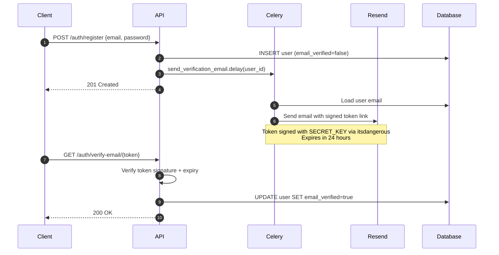

The verification link points to the **frontend** (`FRONTEND_URL/verify-email/{token}`), which then calls the API endpoint. The token is signed with `SECRET_KEY` using `itsdangerous.URLSafeTimedSerializer` — it cannot be forged and expires after 24 hours.

---

##### Login & tokens

The API issues two credentials on login: a short-lived JWT access token and a long-lived opaque refresh token.

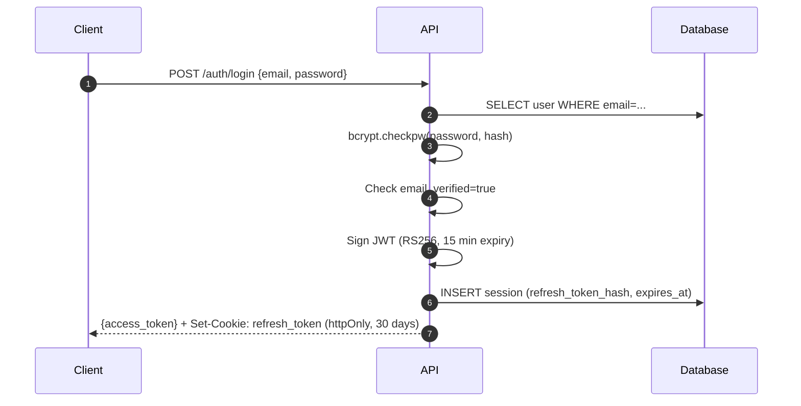

| Credential | Format | Lifetime | Storage |
| --- | --- | --- | --- |
| Access token | JWT RS256 | 15 minutes | Memory / `Authorization` header |
| Refresh token | Opaque random bytes | 30 days | httpOnly cookie (not readable by JS) |

The access token is signed with an **RSA private key** and verified with the corresponding public key. Only the API can issue tokens; any service with the public key can verify them without calling the database.

---

##### Token refresh & replay detection

When the access token expires, the client silently exchanges the refresh cookie for a new pair. If a refresh token is used more than once, the API treats it as a session theft and revokes everything.

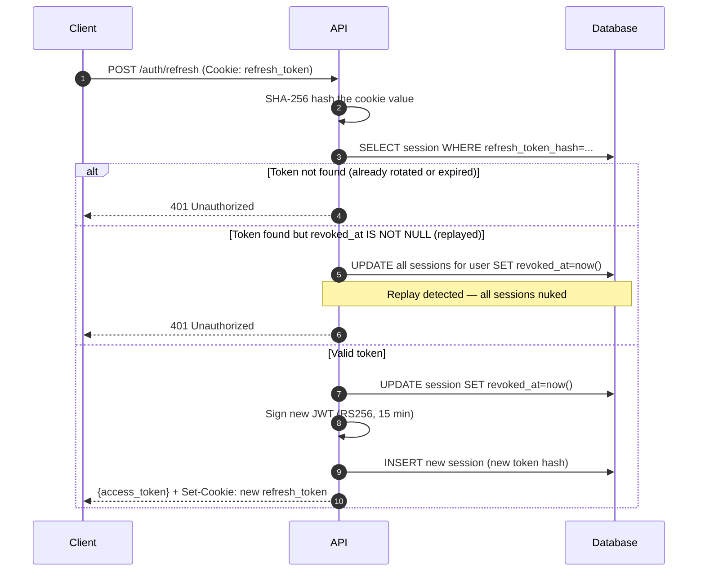

Refresh tokens are **rotated on every use** — each successful refresh invalidates the previous token and issues a new one. This means a stolen refresh token can only be used once before the legitimate user's next request triggers the replay alarm and locks the account out.

---

##### Logout

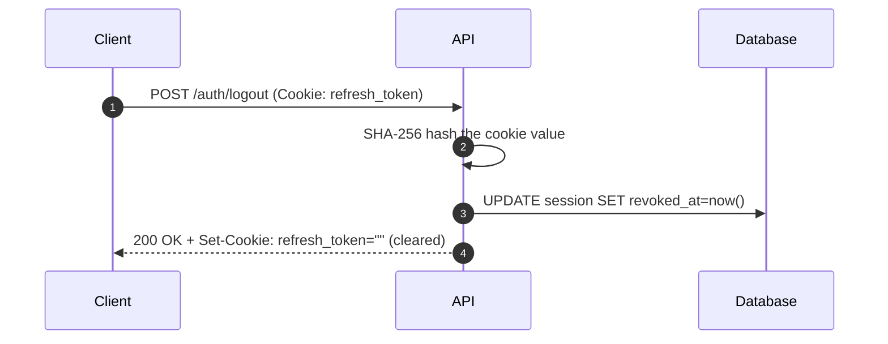

Logout revokes the specific session for the current device. Other sessions (other devices) remain active. A user can revoke individual sessions or all sessions via `DELETE /api/v1/users/me/sessions/{id}`.

---

##### Password reset

The reset flow never reveals whether an email address has an account, preventing user enumeration.

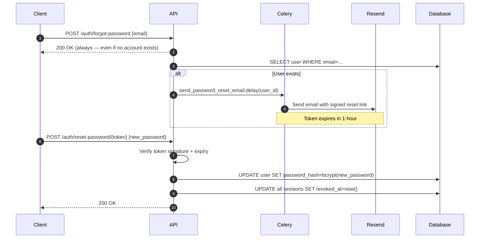

After a successful reset, **all existing sessions are revoked** — any device that was logged in with the old password is signed out.

---

##### Google OAuth2

The OAuth flow uses **PKCE** (Proof Key for Code Exchange) to prevent authorization code interception attacks.

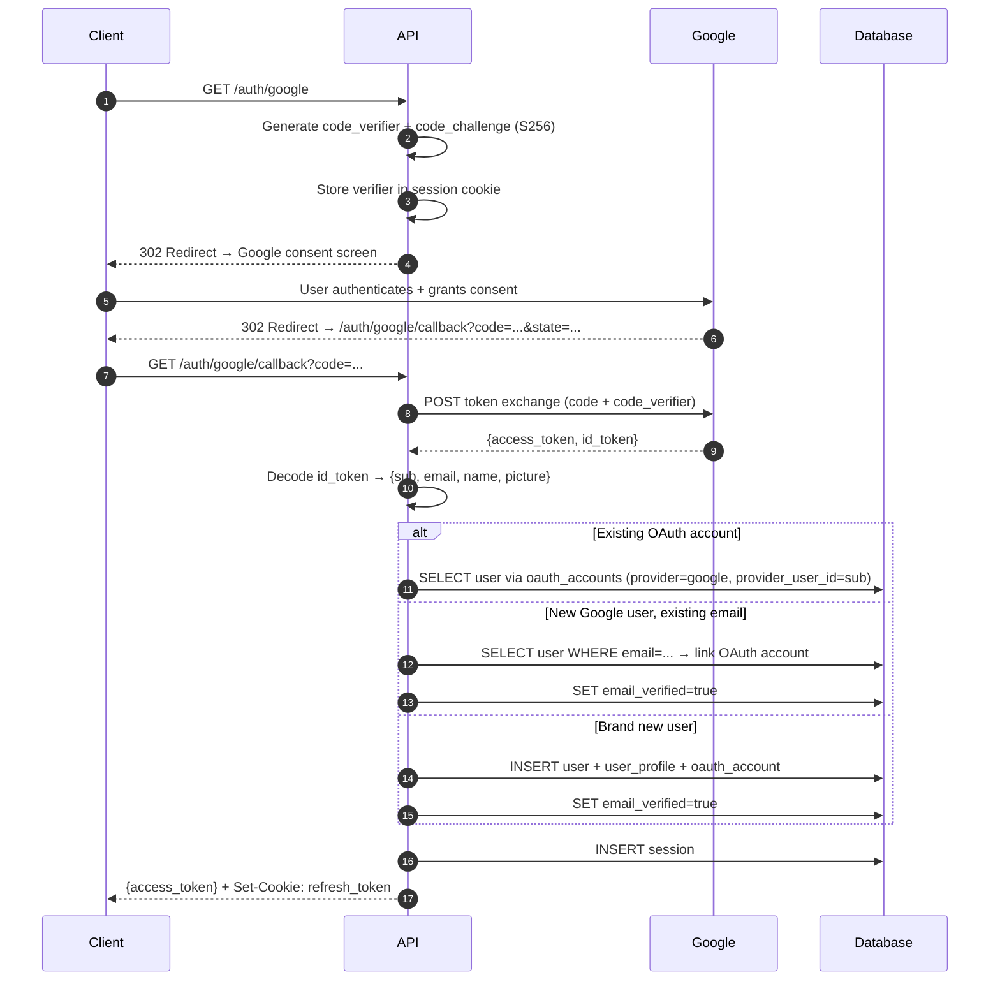

Google-authenticated users have `email_verified=true` set automatically — Google has already verified the email address.

---

##### Role-based access control (RBAC)

Every protected route goes through a dependency chain that validates the token and checks the user's role.

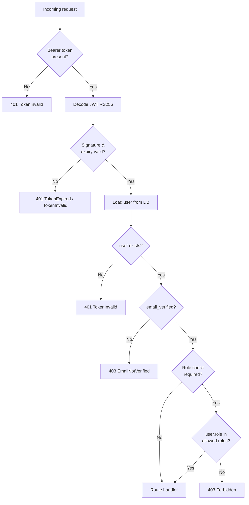

Current roles: `student` (default) and `admin`. Routes use the `require_role()` dependency factory:

```python
# Admin-only route
@router.post("/courses", dependencies=[Depends(require_role(Role.ADMIN))])

# Any authenticated + verified user
@router.get("/users/me", dependencies=[Depends(get_current_verified_user)])
```

---

##### Session management

Every login (password or OAuth) creates a row in the `sessions` table. Users can inspect and revoke their own sessions.

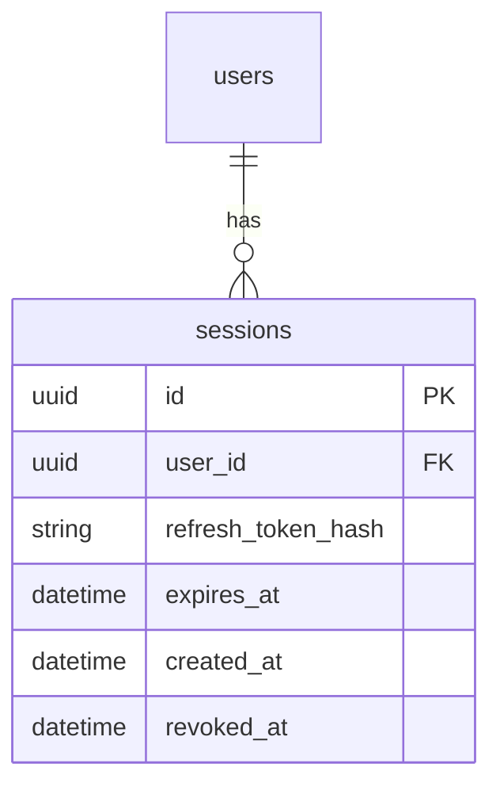

| Endpoint | What it does |
| --- | --- |
| `GET /users/me/sessions` | Lists all sessions — active and revoked |
| `DELETE /users/me/sessions/{id}` | Revokes one session (remote sign-out) |
| `POST /auth/logout` | Revokes the current session |

A session is **active** when `revoked_at IS NULL` and `expires_at > now()`. The refresh token itself is never stored — only its SHA-256 hash is persisted, so a database breach doesn't expose usable tokens.

---

#### Sprint 2 — Course Structure

##### Course lifecycle

Courses move through three statuses. The `slug` is locked after a course is published to protect external links.

```
draft ──► published ──► archived
  │                        ▲
  └────────────────────────┘
```

| Transition | Allowed |
| --- | --- |
| `draft → published` | Yes |
| `draft → archived` | Yes |
| `published → draft` | Yes |
| `published → archived` | Yes |
| `archived → published` | Yes |
| Changing `slug` on a published course | No — returns `409 SLUG_IMMUTABLE` |

##### Full-text search

The `search_vector` column on `courses` is a PostgreSQL `TSVECTOR GENERATED ALWAYS AS STORED` column computed from `title` and `description`. Searches use `plainto_tsquery('english', q)` and results are ranked by `ts_rank`. Only published, non-archived courses are returned.

```bash
# Find courses matching "python"
GET /api/v1/search?q=python

# Empty query is rejected
GET /api/v1/search?q=    → 422 Unprocessable Entity
```

---

#### Sprint 3 — Enrollment & Progress

##### Enrollment lifecycle

A student's enrollment status moves through three states. The row is never hard-deleted, which preserves progress across unenroll / re-enroll cycles.

```
        enroll                 all lessons complete
          │                           │
          ▼                           ▼
       active  ──────────────────► completed
          │
       unenroll
          │
          ▼
      unenrolled
          │
       re-enroll (restores same row)
          │
          ▼
       active
```

| Rule | Detail |
| --- | --- |
| Enrollable courses | Must be `published`, not archived, and `price_cents = 0` (paid gating is Sprint 5) |
| Duplicate enroll | Returns `409 ALREADY_ENROLLED` |
| Re-enroll | Restores the existing row to `active`; prior lesson progress is untouched |
| Unenroll | Sets `status = unenrolled`; progress rows are never deleted |
| Auto-complete | When `POST /progress` marks the last lesson as `completed`, the enrollment is automatically set to `completed` |

##### Progress tracking

```
not_started ──► in_progress ──► completed
```

Status is **forward-only**: sending a lower-rank status in the payload is silently ignored while `watch_seconds` is still updated. This means a re-watch of a completed lesson won't reset its state.

```bash
# Mark a lesson in-progress with a watch position
POST /api/v1/lessons/{id}/progress
{"status": "in_progress", "watch_seconds": 120}

# Mark complete
POST /api/v1/lessons/{id}/progress
{"status": "completed", "watch_seconds": 600}

# Get full course breakdown
GET /api/v1/courses/{id}/progress
# → {"total_lessons": 5, "completed_lessons": 3, "progress_pct": 60.0, "lessons": [...]}
```

##### Enrollment & progress flow

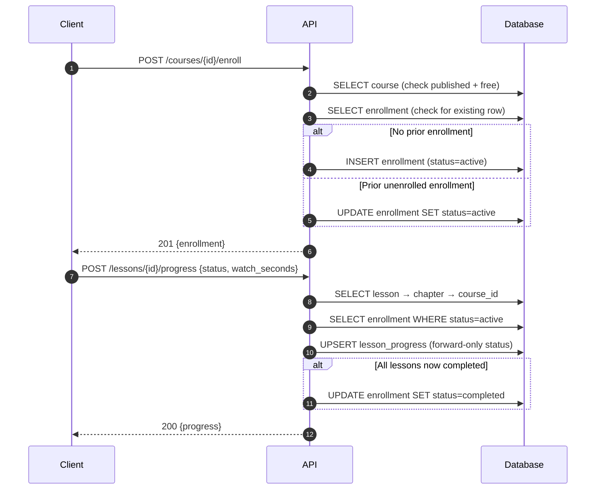

---

#### Sprint 4 — Quizzes & Assignments

##### Quiz flow

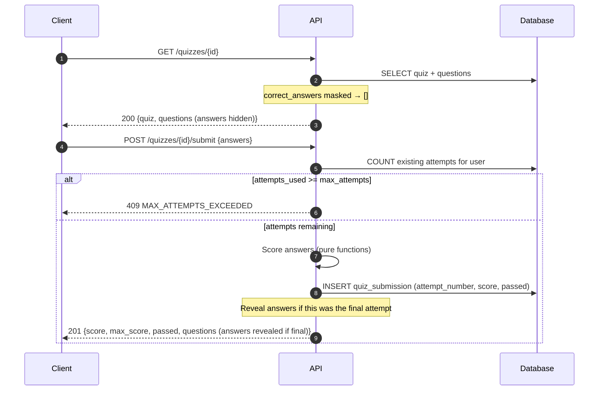

| Rule | Detail |
| --- | --- |
| Scoring | `single_choice`: full points for exactly one correct selection. `multi_choice`: full points only when the selected set exactly matches the correct set — no partial credit |
| Answer masking | `correct_answers` is always `[]` in the response until all attempts are exhausted |
| Attempt guard | `UniqueConstraint(user_id, quiz_id, attempt_number)` prevents double-submission under concurrent requests |

##### Assignment file upload flow

The backend never proxies file bytes. The client uploads directly to Cloudflare R2 via a presigned PUT URL.

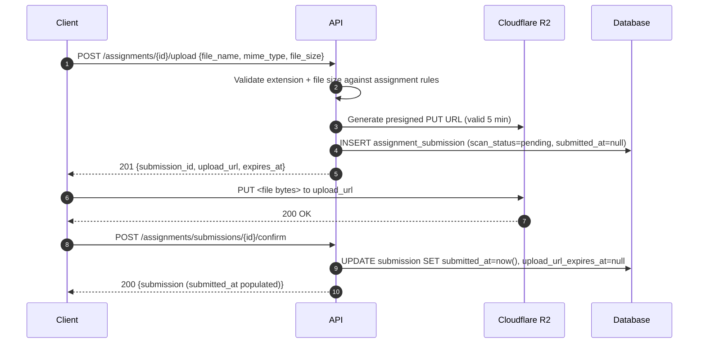

| Field | Detail |
| --- | --- |
| `scan_status` | Defaults to `"pending"`; virus scan wired in Sprint 12 |
| Extension check | Service rejects uploads with disallowed extensions before generating the presigned URL |
| `submitted_at` | `null` until the student calls `/confirm`; indicates an incomplete upload |

---

## 11. Definition of Done

A feature is done when **all** of the following are true:

| Criterion | Requirement |
| --- | --- |
| **Code** | Implementation complete and passes linting (`ruff`, `eslint`) and type checking (`mypy`, TypeScript strict) |
| **Tests** | Unit and integration tests written; no new untested business logic; coverage does not drop below threshold |
| **E2E** | Affected user journeys covered by Playwright (web) or Detox (mobile) |
| **API spec** | OpenAPI spec updated and accurate for any new or changed endpoints |
| **Security** | No new high or critical severity vulnerabilities introduced |
| **Accessibility** | New UI components pass axe-core scan at AA level |
| **Review** | PR reviewed and approved by at least one other engineer |
| **CI green** | All CI checks passing (lint, types, unit tests, integration tests) |
| **Deployed** | Merged to `main` and deployed to staging; smoke test on staging passes |
| **Docs** | Any non-obvious decisions documented in inline comments or ADR |

---

## 14. Deployment & Domain Configuration

> This section covers where the web and mobile clients are deployed, how the domain `xoxoeducation.com` is configured, and what is needed before the first production release.

---

### 14.1 Domain & DNS

**Domain:** `xoxoeducation.com` — registered on Namecheap.

**Action required:** Migrate nameserver management from Namecheap to Cloudflare (free plan). This consolidates DNS for the domain alongside Cloudflare's existing role as CDN, video delivery proxy, and DDoS layer.

**Migration steps:**

1. Add `xoxoeducation.com` as a new site in the Cloudflare dashboard (free plan).
2. Cloudflare scans and imports existing Namecheap DNS records automatically.
3. Cloudflare provides two nameserver hostnames (e.g. `ns1.cloudflare.com`, `ns2.cloudflare.com`).
4. In Namecheap → Domain List → Manage → Nameservers → select **Custom DNS** → paste Cloudflare's nameservers.
5. Propagation completes within minutes to a few hours.

**Subdomain structure:**

| Subdomain | Points to | Cloudflare proxy | Purpose |
| --- | --- | --- | --- |
| `xoxoeducation.com` | Vercel | Orange-cloud (Full strict SSL) or grey-cloud | Next.js web app |
| `www.xoxoeducation.com` | Redirect to apex | — | Handled by Vercel redirect rule |
| `api.xoxoeducation.com` | Railway / Render backend | **Orange-cloud** | FastAPI — Cloudflare absorbs DDoS before it reaches the origin |

> **SSL mode:** Set Cloudflare SSL/TLS mode to **Full (strict)** when orange-cloud proxying is enabled for the Vercel apex domain. This instructs Cloudflare to validate Vercel's origin SSL certificate end-to-end. If any issue arises, switching to grey-cloud (DNS only) is safe — Vercel's own global edge network handles SSL and CDN independently.

---

### 14.2 Web App — Vercel

**Why Vercel:** The canonical host for Next.js 14 App Router. SSR, ISR, edge middleware (used for auth redirects), and preview deployments are all first-class features — no adapter or configuration required.

**Vercel project setup:**

1. Import the GitHub repository into Vercel; set the root directory to `web-client/`.
2. Framework preset: **Next.js** (auto-detected).
3. Add the custom domain `xoxoeducation.com` in Vercel → Project → Domains.
4. Vercel provides the DNS record values (A + CNAME) — add these in Cloudflare.

**Deployment branches:**

| Git branch | Vercel environment | URL |
| --- | --- | --- |
| `main` | Production | `xoxoeducation.com` |
| `staging` | Preview (promoted) | `staging.xoxoeducation.com` (optional) |
| Any PR branch | Preview (auto) | `xoxoedu-pr-42.vercel.app` |

PR preview deployments let the designer review every screen against the design spec before code is merged to `main`.

**Environment variables (set per Vercel environment):**

| Variable | Production value | Preview / Staging value |
| --- | --- | --- |
| `NEXT_PUBLIC_API_URL` | `https://api.xoxoeducation.com` | Staging API URL |
| `NEXT_PUBLIC_STRIPE_KEY` | Stripe live publishable key | Stripe test publishable key |
| `NEXT_PUBLIC_POSTHOG_KEY` | Production analytics key | Test / dev key |
| `NEXT_PUBLIC_MUX_ENV_KEY` | Mux production data key | Mux dev data key |

Sensitive server-side variables (no `NEXT_PUBLIC_` prefix) are not exposed to the browser.

**CI/CD:** GitHub Actions runs lint, type check, and tests on every PR. On merge to `main`, Vercel deploys automatically via its GitHub integration — no separate deploy step needed in Actions.

---

### 14.3 Mobile App — Expo EAS

**Build service: Expo EAS Build**

EAS Build runs iOS and Android builds in the cloud, eliminating the need for a local Mac with Xcode for iOS builds or a local Android Studio setup. Builds are triggered from the CLI or from CI.

```bash
# Install EAS CLI
npm install -g eas-cli

# Log in to Expo account
eas login

# Configure the project (run once)
eas build:configure

# Trigger a production build
eas build --platform all --profile production
```

**EAS configuration (`eas.json` in `mobile-client/`):**

```json
{
  "build": {
    "development": {
      "developmentClient": true,
      "distribution": "internal"
    },
    "preview": {
      "distribution": "internal",
      "ios": { "simulator": false }
    },
    "production": {
      "autoIncrement": true
    }
  },
  "submit": {
    "production": {
      "ios": { "appleId": "your@email.com", "ascAppId": "XXXXXXX" },
      "android": { "serviceAccountKeyPath": "./google-service-account.json", "track": "production" }
    }
  }
}
```

**OTA updates: Expo EAS Update**

JavaScript bundle changes (bug fixes, content updates, UI tweaks) can be pushed to all installed apps without a store submission. Only changes to native code (new permissions, new native modules) require a full build + store review.

```bash
# Push an OTA update to the production channel
eas update --channel production --message "Fix quiz submission race condition"
```

> Use OTA updates aggressively for post-launch fixes. Reserve full store submissions for native changes and major releases. This is the single biggest advantage of an Expo-managed workflow over bare React Native.

**Store accounts required:**

| Store | Account | Cost | Action |
| --- | --- | --- | --- |
| Apple App Store | Apple Developer Program | $99/year | Create at [developer.apple.com](https://developer.apple.com); required for TestFlight beta testing too |
| Google Play Store | Google Play Console | $25 one-time | Create at [play.google.com/console](https://play.google.com/console) |

**TestFlight / Internal testing:**

Use the `preview` EAS build profile to distribute to internal testers via TestFlight (iOS) and the Play Store internal track (Android) before each production release.

---

### 14.4 Email DNS Records

Required before any transactional email (verification, notifications, certificates) will reliably reach inboxes. All three records are added in Cloudflare DNS. Resend or Postmark provide the exact values during their setup flow.

| Record type | Host | Purpose | When to add |
| --- | --- | --- | --- |
| **SPF** | `@` (TXT) | Authorises Resend/Postmark to send on behalf of `xoxoeducation.com` | Before Sprint 1 goes live |
| **DKIM** | Provider-specific subdomain (TXT) | Cryptographic signature on outgoing email | Before Sprint 1 goes live |
| **DMARC** | `_dmarc` (TXT) | Policy for unauthenticated email; start with `p=none` (monitor), move to `p=quarantine` post-launch | Before Sprint 1 goes live |

> Without SPF + DKIM, email verification links and assignment feedback notifications will be silently dropped or spam-foldered by Gmail and Outlook — the two dominant email clients for the student audience.

---

### 14.5 Cost Summary (Early Stage)

| Service | Plan | Cost | Notes |
| --- | --- | --- | --- |
| Vercel | Hobby → Pro | $0 → $20/mo | Start on Hobby; upgrade to Pro when you need team members or commercial use |
| Cloudflare DNS + proxy | Free | $0 | DNS management, DDoS, WAF, SSL — all on the free plan |
| Cloudflare R2 + CDN | Usage-based | ~$0–15/mo | $0.015/GB storage; egress via CDN is free |
| Expo EAS Build | Free → Production | $0 → $99/mo | Free tier has slower build queues; Production adds concurrency and priority |
| Expo EAS Update | Included | — | Included in EAS plans; 1,000 monthly active users free |
| Apple Developer Program | Annual | $99/year | Required for App Store + TestFlight from day 1 |
| Google Play Console | One-time | $25 | One-time registration fee |
| **Estimated early-stage total** | | **~$150–250/year** | Excluding backend (Railway/Render) costs |
